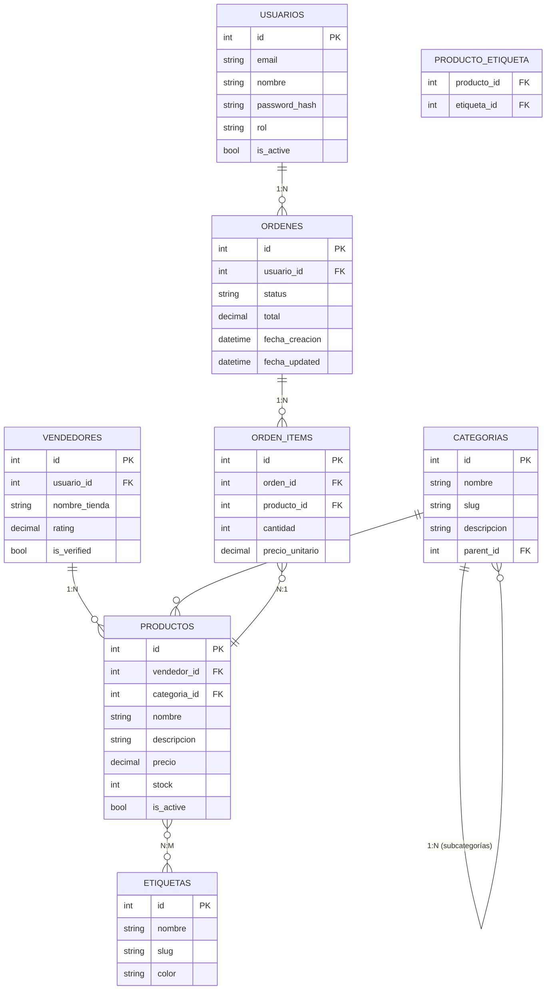

# Curso Completo: CRUD E-Commerce con FastAPI, SQLModel y AsyncPG

## 20 Sesiones (40 Horas)

---

## Tabla de Contenidos

| Sesión | Tema | Archivo | Duración |
|--------|------|---------|----------|
| 1 | Fundamentos de Bases de Datos y SQL | Parte 1 | 2h |
| 2 | Python Asíncrono y AsyncIO | Parte 1 | 2h |
| 3 | SQLModel: ORM Moderno para Python | Parte 1 | 2h |
| 4 | FastAPI: Fundamentos y Routing | Parte 1 | 2h |
| 5 | Conexión a PostgreSQL con AsyncPG | Parte 1 | 2h |
| 6 | CRUD: Create y Read | Parte 1 | 2h |
| 7 | CRUD: Update y Delete | Parte 1 | 2h |
| 8 | Relaciones Uno a Muchos (1:N) | Parte 1 | 2h |
| 9 | Relaciones Muchos a Muchos (N:M) | Parte 1 | 2h |
| 10 | Proyecto Integrador Parte 1 | Parte 1 | 2h |
| 11 | Consultas Avanzadas y Agregaciones | Parte 2 | 2h |
| 12 | Validación y Serialización | Parte 2 | 2h |
| 13 | Manejo de Errores y Excepciones | Parte 2 | 2h |
| 14 | Paginación y Ordenamiento | Parte 2 | 2h |
| 15 | Transacciones y Concurrencia | Parte 2 | 2h |
| 16 | Migraciones con Alembic | Parte 2 | 2h |
| 17 | Autenticación y Autorización | Parte 2 | 2h |
| 18 | Testing | Parte 2 | 2h |
| 19 | Optimización | Parte 2 | 2h |
| 20 | Proyecto Final Integrador | Parte 2 | 2h |

---

## Modelo de Datos del Proyecto



---

## Relaciones Implementadas

| Relación | Tipo | Descripción |
|----------|------|-------------|
| Usuario → Órdenes | 1:N | Un usuario puede tener muchas órdenes |
| Vendedor → Productos | 1:N | Un vendedor puede publicar muchos productos |
| Categoría → Productos | 1:N | Una categoría agrupa muchos productos |
| Categoría → Subcategorías | 1:N | Autoreferencia para jerarquía |
| Orden → OrdenItems | 1:N | Una orden tiene muchos items |
| Producto ↔ Etiqueta | N:M | Muchos productos pueden tener muchas etiquetas |

---

## Stack Tecnológico

- **PostgreSQL 14+**: Base de datos relacional
- **AsyncPG**: Driver asíncrono para PostgreSQL
- **SQLModel**: ORM que combina Pydantic + SQLAlchemy
- **FastAPI**: Framework web de alto rendimiento
- **Alembic**: Migraciones de base de datos
- **Pytest**: Testing
- **Passlib + bcrypt**: Hashing de contraseñas
- **Python-JOSE**: Tokens JWT

---

## Estructura del Proyecto

```
techstore/
├── app/
│   ├── __init__.py
│   ├── main.py              # FastAPI app
│   ├── config.py            # Configuración
│   ├── database/
│   │   └── connection.py    # Async engine + session
│   ├── models/
│   │   ├── usuario.py
│   │   ├── vendedor.py
│   │   ├── producto.py
│   │   ├── categoria.py
│   │   ├── etiqueta.py
│   │   └── orden.py
│   ├── schemas/
│   │   ├── auth.py
│   │   ├── usuario.py
│   │   ├── vendedor.py
│   │   ├── producto.py
│   │   ├── categoria.py
│   │   ├── etiqueta.py
│   │   └── orden.py
│   ├── repositories/
│   │   ├── base.py
│   │   ├── usuario.py
│   │   └── producto.py
│   ├── routes/
│   │   ├── auth.py
│   │   ├── usuarios.py
│   │   ├── vendedores.py
│   │   ├── productos.py
│   │   ├── categorias.py
│   │   ├── etiquetas.py
│   │   └── ordenes.py
│   ├── security/
│   │   ├── jwt.py
│   │   ├── utils.py
│   │   └── deps.py
│   └── exceptions/
│       ├── base.py
│       └── handlers.py
├── tests/
│   ├── conftest.py
│   ├── test_auth.py
│   ├── test_productos.py
│   └── test_ordenes.py
├── alembic/
│   ├── env.py
│   └── versions/
├── requirements.txt
├── .env.example
└── README.md
```

---

## Requisitos

- Python 3.10+
- PostgreSQL 14+
- Redis (opcional, para caching)

---

## Instalación

```bash
# Clonar el proyecto
cd techstore

# Crear entorno virtual
python -m venv venv
source venv/bin/activate  # Linux/Mac
# venv\Scripts\activate   # Windows

# Instalar dependencias
pip install -r requirements.txt

# Configurar variables de entorno
cp .env.example .env
# Editar .env con tu configuración

# Ejecutar migraciones
alembic upgrade head

# Iniciar servidor
uvicorn app.main:app --reload --host 0.0.0.0 --port 8000
```

---

## Documentación Automática

Una vez ejecutando:

- **Swagger UI**: http://localhost:8000/docs
- **ReDoc**: http://localhost:8000/redoc
- **OpenAPI JSON**: http://localhost:8000/openapi.json

---

## Testing

```bash
# Ejecutar todos los tests
pytest

# Con coverage
pytest --cov=app tests/

# Tests específicos
pytest tests/test_productos.py -v

# Tests con async
pytest tests/test_ordenes.py -v -k "asyncio"
```

---

## Resumen de Endpoints

### Autenticación
| Método | Endpoint | Descripción |
|--------|----------|-------------|
| POST | /auth/register | Registrar usuario |
| POST | /auth/login | Iniciar sesión |
| POST | /auth/refresh | Refrescar token |
| GET | /auth/me | Usuario actual |

### Usuarios
| Método | Endpoint | Descripción |
|--------|----------|-------------|
| POST | /usuarios | Crear usuario |
| GET | /usuarios | Listar usuarios |
| GET | /usuarios/{id} | Obtener usuario |
| PUT | /usuarios/{id} | Actualizar usuario |
| DELETE | /usuarios/{id} | Eliminar usuario |

### Productos
| Método | Endpoint | Descripción |
|--------|----------|-------------|
| POST | /productos | Crear producto |
| GET | /productos | Listar con filtros |
| GET | /productos/{id} | Obtener producto |
| PUT | /productos/{id} | Actualizar producto |
| DELETE | /productos/{id} | Soft delete |
| POST | /productos/{id}/etiquetas/{et_id} | Añadir etiqueta |
| DELETE | /productos/{id}/etiquetas/{et_id} | Quitar etiqueta |

### Órdenes
| Método | Endpoint | Descripción |
|--------|----------|-------------|
| POST | /ordenes | Crear orden |
| GET | /ordenes | Listar órdenes |
| GET | /ordenes/{id} | Obtener orden con items |
| PATCH | /ordenes/{id}/status | Cambiar status |
| DELETE | /ordenes/{id} | Cancelar orden |

### Categorías
| Método | Endpoint | Descripción |
|--------|----------|-------------|
| POST | /categorias | Crear categoría |
| GET | /categorias | Listar categorías |
| GET | /categorias/{id} | Obtener categoría |
| GET | /categorias/{id}/productos | Productos de categoría |

### Etiquetas
| Método | Endpoint | Descripción |
|--------|----------|-------------|
| POST | /etiquetas | Crear etiqueta |
| GET | /etiquetas | Listar etiquetas |
| GET | /etiquetas/populares | Tags más usados |

### Vendedores
| Método | Endpoint | Descripción |
|--------|----------|-------------|
| POST | /vendedores | Crear vendedor |
| GET | /vendedores | Listar vendedores |
| GET | /vendedores/{id} | Obtener vendedor con stats |
| GET | /vendedores/{id}/productos | Productos del vendedor |

---

## Contenido Detallado por Sesión

### Parte 1: Fundamentos (Sesiones 1-10)

**Sesión 1 - Fundamentos de BD y SQL**
- Tablas, filas, columnas
- Claves primaria y foránea
- CRUD básico en SQL
- JOINs
- Subconsultas

**Sesión 2 - Python Async y AsyncIO**
- Diferencia sync vs async
- async/await
- Event loop
- Coroutines
- Gather y Tasks

**Sesión 3 - SQLModel**
- Modelos con tipos Python
- Relaciones 1:N y N:M
- Índices y constraints
- Herencia de modelos

**Sesión 4 - FastAPI Fundamentos**
- Rutas GET, POST, PUT, PATCH, DELETE
- Path, Query, Body parameters
- Schemas Pydantic
- Documentación automática

**Sesión 5 - Conexión AsyncPG**
- Pool de conexiones
- Dependencias FastAPI
- Repository pattern
- Session management

**Sesión 6 - CRUD: Create y Read**
- Endpoints POST y GET
- Validaciones
- Filtros básicos

**Sesión 7 - CRUD: Update y Delete**
- PUT vs PATCH
- Soft delete
- Validaciones en cascada

**Sesión 8 - Relaciones 1:N**
- joinedload vs selectinload
- Queries con JOIN
- Filtros basados en relaciones

**Sesión 9 - Relaciones N:M**
- Tablas intermedias
- Association models
- Queries N:M

**Sesión 10 - Proyecto Integrador**
- API funcional completa
- Integración de conceptos

### Parte 2: Avanzado (Sesiones 11-20)

**Sesión 11 - Consultas Avanzadas**
- Aggregaciones (COUNT, SUM, AVG)
- Group By, Having
- Case y condicionales
- Subconsultas y CTEs
- Window functions
- Full-text search

**Sesión 12 - Validación y Serialización**
- Validadores Pydantic personalizados
- Serialización condicional
- Tipos personalizados
- Transformaciones

**Sesión 13 - Manejo de Errores**
- Excepciones personalizadas
- Handlers globales
- Logging
- Respuestas consistentes

**Sesión 14 - Paginación y Ordenamiento**
- Offset-based pagination
- Cursor-based pagination
- Multi-field sorting
- Headers de paginación

**Sesión 15 - Transacciones y Concurrencia**
- ACID
- Savepoints
- Optimistic locking
- SELECT FOR UPDATE
- Patrones de reintento

**Sesión 16 - Migraciones con Alembic**
- Configuración de Alembic
- Crear migraciones
- Modificar esquemas
- Rollback
- Seed data

**Sesión 17 - Autenticación y Autorización**
- JWT tokens
- bcrypt password hashing
- Dependencias de auth
- Roles y permisos

**Sesión 18 - Testing**
- pytest con async
- Fixtures
- Tests de repository
- Tests de endpoints
- Tests con auth

**Sesión 19 - Optimización**
- Índices
- Evitar N+1 queries
- Caching
- Query optimization

**Sesión 20 - Proyecto Final**
- API e-commerce completa
- Todos los conceptos integrados
- Testing básico

---

## Recursos

- [FastAPI Docs](https://fastapi.tiangolo.com/)
- [SQLModel Docs](https://sqlmodel.tiangolo.com/)
- [asyncpg Docs](https://magicstack.github.io/asyncpg/)
- [PostgreSQL Docs](https://www.postgresql.org/docs/)
- [Alembic Docs](https://alembic.sqlalchemy.org/)
- [Pytest Docs](https://docs.pytest.org/)

---

*Curso creado en Marzo 2026*
*Versión 1.0*
