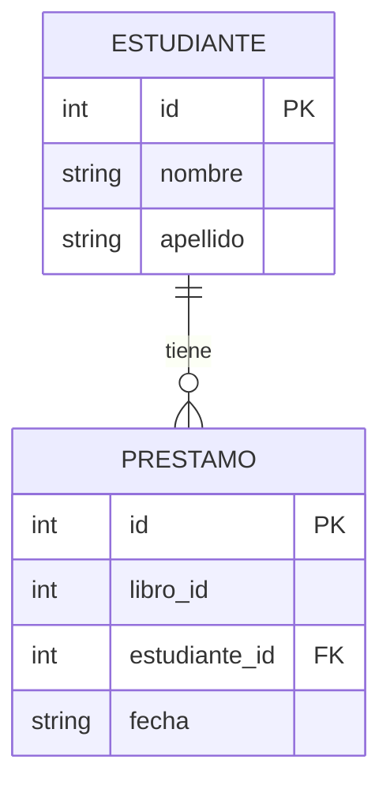
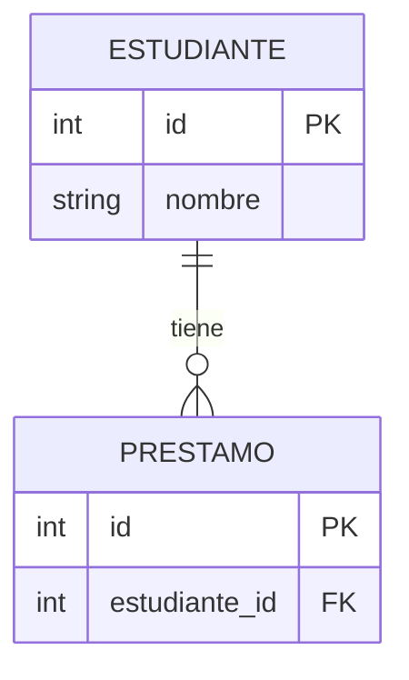
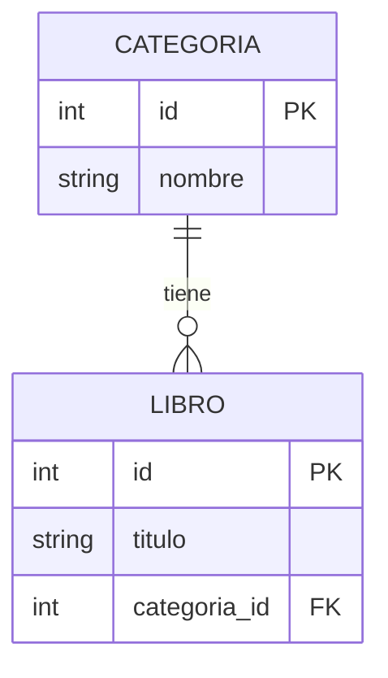
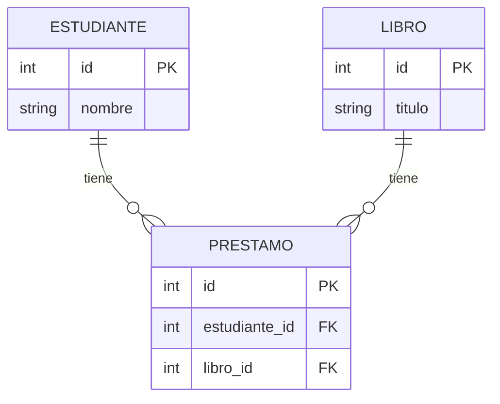

# Curso de Bases de Datos, SQL y FastAPI para jóvenes de 15-16 años

## Guía del Instructor

### Información General del Curso

- **Duración Total**: 20 sesiones de 2 horas (40 horas totales)
- **Público Objetivo**: jóvenes de 15-16 años
- **Herramientas**: Python, SQLModel, FastAPI, SQLite
- **Requisitos Previos**: Conocimiento básico de Python

### Objetivos del Curso

1. Comprender qué es una base de datos y por qué es importante
2. Aprender a diseñar tablas correctamente (modelado de datos)
3. Dominar SQL básico para manipular datos
4. Introducirse en SQLModel como ORM para Python
5. Crear APIs REST básicas con FastAPI que interactúen con bases de datos
6. Desarrollar un proyecto final integrador

### Metodología

- **Teoría**: Explicaciones cortas (15-20 min)
- **Práctica**: Ejercicios guiados (60-70 min)
- **Proyecto**: Desarrollo progresivo a lo largo del curso
- **Evaluación**: ejercicios rápidos al inicio de cada clase + proyecto final

### Proyecto Final

Los estudiantes construirán una **API para una biblioteca escolar** que permita:
- Registrar libros
- Registrar estudiantes
- Prestar y devolver libros
- Buscar libros por título o autor

---

## Sesión 1: ¿Qué es una Base de Datos? 📦

### Objetivo
Comprender qué es una base de datos y por qué la necesitamos.

### Contenido Teórico (30 min)

**¿Qué es una Base de Datos?**

Imagina que tienes una tienda de videojuegos. ¿Cómo sabrías qué juegos tienes, cuánto cuestan, cuántos quedan?

Opciones:
1. **En papel** - Muy lento para buscar
2. **Excel/Google Sheets** - Mejor, pero limitado
3. **Base de Datos** - ¡La mejor opción!

Una **base de datos** es como una colección organizada de información guardada en un computador. Piensa en ella como un Excel muy potente que:

- Puede guardar millones de registros
- Busca información muy rápido
- Permite que muchas personas accedan al mismo tiempo
- Mantiene los datos seguros

**¿Qué tipos de bases de datos existen?**

1. **Relacionales (SQL)**: Organizan datos en tablas con filas y columnas. Como una hoja de Excel. Ejemplos: MySQL, PostgreSQL, SQLite
2. **NoSQL**: No usan tablas. Ejemplos: MongoDB (documentos), Redis (clave-valor)

Nosotros usaremos **SQLite**, que es una base de datos relacional guardada en un solo archivo. Perfecta para aprender y para proyectos pequeños.

### Conceptos Clave (10 min)

| Término | Significado |
|---------|------------|
| **Tabla** | Una colección de datos organizados en filas y columnas (como una tabla de Excel) |
| **Fila (Row)** | Un registro individual. Ejemplo: los datos de UN libro |
| **Columna (Column)** | Un tipo de dato específico. Ejemplo: "título", "autor", "precio" |
| **Base de Datos** | La colección completa de tablas |
| **Campo** | Cada celda individual en una tabla |

### Ejemplo Visual (10 min)

**Tabla: `libros`**

| id | titulo | autor | precio | stock |
|----|--------|-------|--------|-------|
| 1 | Harry Potter | J.K. Rowling | 25.00 | 10 |
| 2 | El Señor de los Anillos | J.R.R. Tolkien | 30.00 | 5 |
| 3 | Ready Player One | Ernest Cline | 22.00 | 8 |

### Práctica (50 min)

**Ejercicio 1**: Piensa en 3 situaciones de la vida real donde necesites guardar información organizada. ¿Qué tablas necesitarías?

**Situaciones de ejemplo**:
- Biblioteca escolar
- Tienda de ropa
- Sistema de calificaciones
- Videojuego

**Ejercicio 2**: Dibuja en papel una tabla para guardar información de los estudiantes de tu clase. ¿Qué columnas tendrías?

### Tarea para Casa
Piensa en el proyecto final: ¿Qué información necesitarías guardar para una biblioteca escolar? Escribe las tablas que se te ocurrirían.

---

## Sesión 2: Diseñando Mis Primeras Tablas 🎨

### Objetivo
Aprender a diseñar tablas correctamente usando conceptos de modelado de datos.

### Repaso y Conexión (10 min)
- ¿Qué es una tabla?
- ¿Qué datos pondrías en la tabla `libros`?

### Contenido Teórico (35 min)

**Reglas para Diseñar Buenas Tablas**

**Regla 1: Cada tabla representa UN tipo de cosa**

❌ Mal: Mezclar libros y estudiantes en la misma tabla
✅ Bien: Una tabla para libros, otra para estudiantes

**Regla 2: Cada columna tiene un solo tipo de dato**

✅ Bien: La columna "edad" siempre tiene números
❌ Mal: A veces texto, a veces números

**Regla 3: Cada fila es única**

Por eso necesitamos un **identificador único** llamado **clave primaria** (primary key).

**¿Qué es una Clave Primaria?**

Es un valor único para cada fila. Como el número de serie de tu celular - no hay dos iguales.

Opciones:
1. **Número automático** (1, 2, 3...) - El más común
2. **Letras y números** (LIB001, LIB002...)
3. **UUID** (código largo único)

### Ejemplo: Tabla `estudiantes`

```
estudiantes
├── id (clave primaria) ← Número único
├── nombre 
├── apellido
├── email
├── fecha_nacimiento
└── grado
```

### Tipos de Datos (15 min)

| Tipo de Dato | Ejemplo | Uso |
|--------------|---------|-----|
| `INTEGER` | 1, 2, 3, -5 | Números enteros |
| `REAL` | 3.14, 25.99 | Números con decimales |
| `TEXT` | "Hola", "María" | Letras y palabras |
| `BLOB` | (datos binarios) | Imágenes, archivos |

### Práctica (40 min)

**Ejercicio 1**: Diseña la tabla `canciones` para una app de música. ¿Qué columnas necesitas?

**Ejercicio 2**: Diseña la tabla `productos` para una tienda online.

**Ejercicio 3**: Con tu compañero, revisen el diseño del otro. ¿Harían algún cambio?

### Proyecto Final - Introducción
Hoy empezamos a pensar en nuestro proyecto: **Biblioteca Escolar API**

Primer diseño de tablas:
- `libros`: id, título, autor, isbn, categoría
- `estudiantes`: id, nombre, apellido, email, grado
- `prestamos`: id, libro_id, estudiante_id, fecha_prestamo, fecha_devolucion

---

## Sesión 3: Primary Keys y Foreign Keys 🔑

### Objetivo
Entender cómo conectar tablas entre sí.

### Repaso (10 min)
- ¿Qué es una clave primaria?
- Dibujemos la tabla `estudiantes` en la pizarra

### Contenido Teórico (30 min)

**¿Por qué conectar tablas?**

En el mundo real, los datos están relacionados:
- Un estudiante pide prestados muchos libros
- Un libro puede ser prestado a diferentes estudiantes

No queremos repetir información. Si el estudiante "María" cambia de grado, ¡no queremos actualizar 10 filas!

**¿Qué es una Foreign Key (Clave Foránea)?**

Es una columna que apunta a la clave primaria de OTRA tabla.

### Ejemplo Visual

La tabla `prestamos` tiene una columna `estudiante_id` que apunta a `id` en `estudiantes`:



### Cómo Se Lee
"Este préstamo fue hecho por el estudiante con id=1, es decir, María García"

### Ejercicio en Clase (20 min)

**Dibuja las relaciones:**

1. Sistema de une red social:
   - `usuarios`: id, nombre, email
   - `publicaciones`: id, texto, fecha
   - ¿Cómo las conectas?

2. Sistema de une restaurante:
   - `mesas`: id, numero, capacidad
   - `reservas`: id, nombre_cliente, fecha, hora

### Práctica (40 min)

**Ejercicio 1**: Completa el diseño de la biblioteca
- `libros`: id (PK), titulo, autor, isbn, categoria_id (FK)
- `categorias`: id (PK), nombre
- `estudiantes`: id (PK), nombre, apellido, email, grado
- `prestamos`: id (PK), libro_id (FK), estudiante_id (FK), fecha_prestamo, fecha_devolucion

**Ejercicio 2**: Dibuja las flechas mostrando cómo se conectan las tablas.

### Concepto Nuevo: Normalización (10 min)
La normalización es seguir reglas para que nuestra base de datos sea eficiente y no tenga información repetida.

**Primera Forma Normal (1NF)**: Cada celda tiene un solo valor (no listas)

❌ Mal: `telefonos: "123456, 789012"`
✅ Bien: Tener una tabla `telefonos` separada

---

## Sesión 4: Tu Primera Base de Datos con SQLite 🗄️

### Objetivo
Crear bases de datos y tablas usando SQL real.

### Contenido Teórico (20 min)

**¿Qué es SQL?**

SQL (Structured Query Language) es el "idioma" que usamos para comunicarnos con las bases de datos relacionales.

Es como aprender comandos básicos de Git:
- SELECT (buscar)
- INSERT (crear)
- UPDATE (modificar)
- DELETE (eliminar)

**¿Qué es SQLite?**

Es una base de datos que guarda todo en UN SOLO ARCHIVO. No necesitas instalar un servidor. ¡Perfecto para aprender!

### Instalación y Primeros Pasos (20 min)

```bash
# Instalar SQLite (ya viene incluido en muchos sistemas)
# Verificar instalación
sqlite3 --version

# Crear una base de datos nueva
sqlite3 mi_primera_base.db

# Ver tablas existentes
.tables

# Salir
.quit
```

### Crear Nuestra Primera Tabla (20 min)

```sql
CREATE TABLE libros (
    id INTEGER PRIMARY KEY,
    titulo TEXT NOT NULL,
    autor TEXT NOT NULL,
    precio REAL
);
```

**Explicación**:
- `CREATE TABLE libros` → Crea la tabla "libros"
- `id INTEGER PRIMARY KEY` → Columna id, número entero, clave primaria
- `titulo TEXT NOT NULL` → Título, texto, obligatorio
- `precio REAL` → Precio, número decimal

### Insertar Datos (20 min)

```sql
-- Insertar un libro
INSERT INTO libros (titulo, autor, precio)
VALUES ('Harry Potter', 'J.K. Rowling', 25.99);

-- Insertar varios
INSERT INTO libros (titulo, autor, precio)
VALUES 
    ('El Señor de los Anillos', 'J.R.R. Tolkien', 30.50),
    ('Ready Player One', 'Ernest Cline', 22.00);
```

### Ver los Datos (20 min)

```sql
-- Ver todos los libros
SELECT * FROM libros;

-- Ver solo títulos y autores
SELECT titulo, autor FROM libros;

-- Ver libros con precio mayor a 23
SELECT * FROM libros WHERE precio > 23;
```

### Práctica Libre (20 min)
Crea tus propias tablas:
1. Tabla `estudiantes` con al menos 4 columnas
2. Inserta 3 registros
3. Practica SELECT con diferentes condiciones

---

## Sesión 5: SQL - SELECT y WHERE 🔍

### Objetivo
Dominar la búsqueda de datos con SELECT y WHERE.

### Repaso (10 min)
- ¿Cómo insertamos datos?
- ¿Cómo vimos todos los datos?

### Contenido Teórico (30 min)

**SELECT - Buscar Datos**

```sql
-- Buscar TODOS los campos
SELECT * FROM estudiantes;

-- Buscar campos específicos
SELECT nombre, email FROM estudiantes;

-- Buscar con alias (nombre más bonito)
SELECT nombre AS "Nombre del Estudiante" FROM estudiantes;
```

**WHERE - Condiciones**

```sql
-- Estudiantes del grado 10
SELECT * FROM estudiantes WHERE grado = 10;

-- Estudiantes mayores de 15 años
SELECT * FROM estudiantes WHERE edad > 15;

-- Textos que contengan cierta palabra
SELECT * FROM libros WHERE titulo LIKE '%Harry%';

-- Ordenar resultados
SELECT * FROM libros ORDER BY precio;  -- Ascendente
SELECT * FROM libros ORDER BY precio DESC;  -- Descendente
```

### Operadores de Comparación

| Operador | Significado |
|----------|-------------|
| `=` | Igual a |
| `>` | Mayor que |
| `<` | Menor que |
| `>=` | Mayor o igual |
| `<=` | Menor o igual |
| `!=` | Diferente de |
| `LIKE` | Busca patrones en texto |

### Práctica (50 min)

**Ejercicio 1**: Usando la tabla `libros`:
- Busca todos los libros de Tolkien
- Busca libros con precio menor a 25
- Busca libros ordenados por precio (más barato primero)
- Busca libros cuyo título empiece con "El"

**Ejercicio 2**: Crea una tabla `productos` con columnas para nombre, categoría, precio. Inserta 5 productos y practica queries.

### Desafío (20 min)
Encuentra el libro más caro de la tabla usando SQL (investiga MAX).

---

## Sesión 6: SQL - INSERT, UPDATE, DELETE ✏️

### Objetivo
Aprender a crear, modificar y eliminar datos.

### Contenido Teórico (25 min)

**INSERT - Crear Datos**

```sql
-- Insertar un registro completo
INSERT INTO estudiantes (nombre, apellido, email, edad, grado)
VALUES ('Carlos', 'García', 'carlos@email.com', 16, 10);

-- Insertar varios a la vez
INSERT INTO estudiantes (nombre, apellido, email, edad, grado)
VALUES 
    ('María', 'López', 'maria@email.com', 15, 9),
    ('Juan', 'Martínez', 'juan@email.com', 16, 10);
```

**UPDATE - Modificar Datos**

⚠️ ¡MUY IMPORTANTE! Siempre usa WHERE con UPDATE, si no modificas TODOS los registros.

```sql
-- Actualizar un registro específico
UPDATE estudiantes 
SET grado = 11 
WHERE id = 5;

-- Actualizar varios campos a la vez
UPDATE estudiantes 
SET grado = 11, edad = 17 
WHERE id = 5;

-- Actualizar basado en condición
UPDATE libros 
SET precio = precio * 0.9  -- 10% de descuento
WHERE precio > 30;
```

**DELETE - Eliminar Datos**

⚠️ ¡MUY IMPORTANTE! Siempre usa WHERE con DELETE, si no eliminas TODOS los registros.

```sql
-- Eliminar un registro específico
DELETE FROM estudiantes WHERE id = 5;

-- Eliminar varios
DELETE FROM estudiantes WHERE grado = 9;

-- Eliminar todos (¡cuidado!)
DELETE FROM estudiantes;
```

### Práctica (55 min)

**Ejercicio 1 - CRUD Completo**:
1. Crea una tabla `videojuegos` con: id, nombre, plataforma, precio, cantidad
2. Inserta 5 videojuegos
3. Actualiza el precio de uno
4. Actualiza la cantidad de otro (aumenta en 10)
5. Elimina uno que ya no esté disponible

**Ejercicio 2 - En elProyecto**:
1. Crea la tabla `categorias` para la biblioteca
2. Inserta categorías: Ficción, No Ficción, Ciencias, Historia, Arte
3. Actualiza el nombre de una categoría
4. Elimina una categoría que no necesites

### Reflexión (10 min)
¿Por qué es importante usar WHERE con UPDATE y DELETE?
¿Qué pasaría si olvidamos el WHERE?

---

## Sesión 7: Relaciones entre Tablas - JOIN 🤝

### Objetivo
Aprender a conectar tablas y obtener datos de varias tablas a la vez.

### Repaso (10 min)
- ¿Qué es una foreign key?
- ¿Cómo conectamos estudiantes con préstamos?

### Contenido Teórico (40 min)

**¿Por qué necesitamos JOIN?**

Si quieres ver "qué libros tiene prestados María", necesitas:
1. Encontrar el ID de María en `estudiantes`
2. Buscar en `prestamos` dónde `estudiante_id` sea ese ID
3. Para cada préstamo, buscar el libro en `libros`

¡JOIN hace todo esto automáticamente!

**INNER JOIN - Solo coincidencias**

```sql
SELECT estudiantes.nombre, libros.titulo, prestamos.fecha_prestamo
FROM prestamos
INNER JOIN estudiantes ON prestamos.estudiante_id = estudiantes.id
INNER JOIN libros ON prestamos.libro_id = libros.id;
```

**Explicación paso a paso**:
1. Empezamos desde `prestamos`
2. Conectamos con `estudiantes` donde `prestamos.estudiante_id = estudiantes.id`
3. Conectamos con `libros` donde `prestamos.libro_id = libros.id`
4. Seleccionamos las columnas que queremos ver

### Tipos de JOIN

**INNER JOIN**: Solo registros que existen en AMBAS tablas



**Resultado de INNER JOIN**: Solo María (tiene prestamo)

| id | nombre | libro_id |
|----|--------|----------|
| 1  | María  | 1        |

**LEFT JOIN**: Todos los de la izquierda + los que coincidan de la derecha

**FULL OUTER JOIN**: Todos los registros de ambas tablas

### Práctica (50 min)

**Ejercicio 1**: Usando las tablas de biblioteca:
- Ver todos los préstamos con el nombre del estudiante
- Ver todos los préstamos con el título del libro
- Ver préstamos del estudiante "María"

**Ejercicio 2**: Crea las tablas necesarias:
```sql
CREATE TABLE categorias (
    id INTEGER PRIMARY KEY,
    nombre TEXT NOT NULL
);

CREATE TABLE libros (
    id INTEGER PRIMARY KEY,
    titulo TEXT NOT NULL,
    autor TEXT NOT NULL,
    categoria_id INTEGER,
    FOREIGN KEY (categoria_id) REFERENCES categorias(id)
);

CREATE TABLE estudiantes (
    id INTEGER PRIMARY KEY,
    nombre TEXT NOT NULL,
    apellido TEXT NOT NULL
);
```

Inserta datos y practica JOINs.

---

## Sesión 8: Funciones de Agregación y GROUP BY 📊

### Objetivo
Aprender a hacer cálculos y resúmenes de datos.

### Contenido Teórico (30 min)

**¿Qué son las funciones de agregación?**

Son funciones que combinan muchos valores en UNO solo:
- `COUNT()` - Contar
- `SUM()` - Sumar
- `AVG()` - Promedio
- `MAX()` - Máximo
- `MIN()` - Mínimo

### Ejemplos

```sql
-- ¿Cuántos libros tenemos?
SELECT COUNT(*) FROM libros;

-- ¿Cuál es el precio promedio?
SELECT AVG(precio) FROM libros;

-- ¿Cuál es el libro más caro?
SELECT MAX(precio) FROM libros;

-- ¿Cuál es el libro más barato?
SELECT MIN(precio) FROM libros;

-- ¿Cuánto dinero tenemos en inventario?
SELECT SUM(precio * cantidad) FROM libros;
```

### GROUP BY - Agrupar Resultados

```sql
-- ¿Cuántos libros hay por categoría?
SELECT categoria_id, COUNT(*) as cantidad
FROM libros
GROUP BY categoria_id;

-- ¿Cuántos préstamos ha hecho cada estudiante?
SELECT estudiante_id, COUNT(*) as total_prestamos
FROM prestamos
GROUP BY estudiante_id;
```

### HAVING - Filtrar Grupos

WHERE filtra FILAS, HAVING filtra GRUPOS:

```sql
-- Estudiantes con más de 3 préstamos
SELECT estudiante_id, COUNT(*) as total
FROM prestamos
GROUP BY estudiante_id
HAVING COUNT(*) > 3;
```

### Práctica (50 min)

**Ejercicio 1**: En la biblioteca:
- Cuenta cuántos préstamos tiene cada estudiante
- Calcula el promedio de edad de los estudiantes
- Encuentra el estudiante más joven
- Cuenta cuántos libros hay por categoría

**Ejercicio 2**: Análisis de ventas
Crea una tabla `ventas` con: id, producto, categoria, cantidad, precio_unitario

```sql
INSERT INTO ventas (producto, categoria, cantidad, precio_unitario) VALUES
    ('Camiseta', 'Ropa', 3, 25.00),
    ('Pantalón', 'Ropa', 2, 45.00),
    ('Zapatos', 'Calzado', 1, 80.00),
    ('Camiseta', 'Ropa', 5, 25.00),
    ('Gorra', 'Accesorios', 4, 15.00);
```

Encuentra:
- Total de ventas por categoría
- Ingreso total por producto
- Producto más vendido

---

## Sesión 9: Instalación de Herramientas y Primeros Pasos con SQLModel 🐍

### Objetivo
Configurar el entorno de desarrollo con Python, SQLModel y FastAPI.

### Contenido Teórico (20 min)

**¿Qué es un ORM y por qué usar SQLModel?**

**Sin ORM (SQL puro)**:
```sql
INSERT INTO libros (titulo, autor, precio) VALUES ('Harry Potter', 'J.K. Rowling', 25.99);
```

**Con SQLModel (Python)**:
```python
libro = Libro(titulo="Harry Potter", autor="J.K. Rowling", precio=25.99)
session.add(libro)
```

**Ventajas del ORM**:
- Usamos objetos de Python (más intuitivo)
- Validación automática de datos
- Menos código SQL
- Proteção contra SQL injection

### Instalación (30 min)

```bash
# Crear carpeta del proyecto
mkdir biblioteca-api
cd biblioteca-api

# Crear entorno virtual (¡SIEMPRE!)
python -m venv venv

# Activar el entorno
# En Windows:
venv\Scripts\activate
# En Mac/Linux:
source venv/bin/activate

# Instalar dependencias
pip install sqlmodel fastapi uvicorn
```

### Tu Primer Modelo SQLModel (40 min)

Crea el archivo `main.py`:

```python
from sqlmodel import SQLModel, Field

# Definimos la tabla como una clase
class Libro(SQLModel, table=True):
    id: int | None = Field(default=None, primary_key=True)
    titulo: str
    autor: str
    precio: float
    
# Esta clase = tabla en la base de datos
# Cada atributo = columna
```

### Crear la Base de Datos (30 min)

```python
from sqlmodel import SQLModel, Field, create_engine, Session

class Libro(SQLModel, table=True):
    id: int | None = Field(default=None, primary_key=True)
    titulo: str
    autor: str
    precio: float

# Crear la conexión a SQLite
engine = create_engine("sqlite:///biblioteca.db")

# Crear todas las tablas
SQLModel.metadata.create_all(engine)

# Crear un libro
libro1 = Libro(titulo="Harry Potter", autor="J.K. Rowling", precio=25.99)

# Guardar en la base de datos
with Session(engine) as session:
    session.add(libro1)
    session.commit()
```

### Práctica (30 min)
1. Crea el modelo `Estudiante` con: id, nombre, apellido, email, grado
2. Crea la base de datos
3. Inserta 3 estudiantes

---

## Sesión 10: SQLModel - CRUD Completo 📝

### Objetivo
Implementar las cuatro operaciones básicas: Create, Read, Update, Delete.

### Repaso (10 min)
- ¿Qué es `Session`?
- ¿Para qué sirve `commit()`?

### Contenido Teórico (40 min)

**Estructura del Código**

```python
from sqlmodel import SQLModel, Field, create_engine, Session, select

engine = create_engine("sqlite:///biblioteca.db")
SQLModel.metadata.create_all(engine)

# Función auxiliar para obtener sesión
def get_session():
    with Session(engine) as session:
        yield session
```

**CREATE - Crear (INSERT)**

```python
def crear_libro(session: Session, titulo: str, autor: str, precio: float):
    libro = Libro(titulo=titulo, autor=autor, precio=precio)
    session.add(libro)
    session.commit()
    session.refresh(libro)  # Actualiza con el ID generado
    return libro
```

**READ - Leer (SELECT)**

```python
# Leer todos
def leer_todos_los_libros(session: Session):
    return session.exec(select(Libro)).all()

# Leer uno por ID
def leer_libro_por_id(session: Session, libro_id: int):
    return session.get(Libro, libro_id)

# Buscar con condición (equivalente a WHERE)
def buscar_libros_por_autor(session: Session, autor: str):
    return session.exec(select(Libro).where(Libro.autor == autor)).all()
```

**UPDATE - Actualizar**

```python
def actualizar_precio(session: Session, libro_id: int, nuevo_precio: float):
    libro = session.get(Libro, libro_id)
    if libro:
        libro.precio = nuevo_precio
        session.commit()
        session.refresh(libro)
    return libro
```

**DELETE - Eliminar**

```python
def eliminar_libro(session: Session, libro_id: int):
    libro = session.get(Libro, libro_id)
    if libro:
        session.delete(libro)
        session.commit()
        return True
    return False
```

### Práctica (50 min)

**Ejercicio 1**: Implementa las funciones para `Estudiante`

**Ejercicio 2**: Crea un archivo `operaciones.py` con todas las funciones CRUD para ambas tablas

**Ejercicio 3**: Prueba todas las funciones en un script main

```python
# main.py
from operaciones import crear_libro, leer_todos_los_libros

# Crear algunos libros
crear_libro("Harry Potter", "J.K. Rowling", 25.99)
crear_libro("El Señor de los Anillos", "J.R.R. Tolkien", 30.50)

# Leer todos
libros = leer_todos_los_libros()
for libro in libros:
    print(f"{libro.id}: {libro.titulo} - ${libro.precio}")
```

---

## Sesión 11: Indexación y Optimización ⚡

### Objetivo
Entender cómo mejorar el rendimiento de las consultas.

### Contenido Teórico (25 min)

**¿Qué es un Índice?**

Imagina un libro de 1000 páginas. Sin índice, para buscar "Python" tendrías que leer todo. Con índice, vas directo a las páginas que mencionan Python.

En bases de datos, un **índice** hace lo mismo: acelera las búsquedas.

**¿Cuándo crear índices?**
- En columnas que buscas frecuentemente (WHERE)
- En columnas que ordenas (ORDER BY)
- En claves foráneas (FK)

**¿Cuándo NO crear índices?**
- En tablas muy pequeñas
- En columnas que casi nunca buscas
- En columnas que cambian mucho (UPDATE frecuente)

### Índices en SQL

```sql
-- Crear índice
CREATE INDEX idx_autor ON libros(autor);

-- Crear índice único (no permite valores duplicados)
CREATE UNIQUE INDEX idx_isbn ON libros(isbn);

-- Eliminar índice
DROP INDEX idx_autor;
```

### Índices en SQLModel

```python
class Libro(SQLModel, table=True):
    id: int | None = Field(default=None, primary_key=True)
    titulo: str = Field(index=True)  # Índice automático
    autor: str = Field(index=True)    # Índice automático
    isbn: str = Field(unique=True)   # Valor único
```

### Práctica (35 min)

**Ejercicio 1**: Crea un modelo con índices y verifica en SQLite:
```sql
-- Ver índices creados
.indexes ON libros;
```

**Ejercicio 2**: Compara tiempos de búsqueda con y sin índice en una tabla grande.

### Conceptos de Optimización (30 min)

**Reglas básicas**:
1. Solo selecciona las columnas que necesites: `SELECT titulo, autor` NO `SELECT *`
2. Usa límites: `LIMIT 10` cuando solo necesitas algunos resultados
3. Filtra temprano: `WHERE` reduce los datos temprano

```python
# Mal (toma todo y luego filtra en Python)
libros = session.exec(select(Libro)).all()
libros_caros = [l for l in libros if l.precio > 25]

# Bien (filtra en la base de datos)
libros_caros = session.exec(
    select(Libro).where(Libro.precio > 25)
).all()
```

---

## Sesión 12: Relaciones con SQLModel - Parte 1 🔗

### Objetivo
Implementar relaciones entre tablas usando SQLModel.

### Repaso (10 min)
- ¿Qué es una foreign key?
- ¿Cómo connectamos tablas en SQL?

### Contenido Teórico (40 min)

**Relación Uno a Muchos**

Un categoría tiene muchos libros. Un libro pertenece a una categoría.



**En SQLModel:**

```python
from typing import Optional, List
from sqlmodel import SQLModel, Field, Relationship

class Categoria(SQLModel, table=True):
    id: int | None = Field(default=None, primary_key=True)
    nombre: str
    
    # Relación: una categoría tiene muchos libros
    libros: List["Libro"] = Relationship(back_populates="categoria")

class Libro(SQLModel, table=True):
    id: int | None = Field(default=None, primary_key=True)
    titulo: str
    autor: str
    
    # Foreign Key
    categoria_id: Optional[int] = Field(default=None, foreign_key="categoria.id")
    
    # Relación inversa
    categoria: Optional["Categoria"] = Relationship(back_populates="libros")
```

### Crear Datos Relacionados

```python
# Crear categoría
categoria = Categoria(nombre="Ficción")
session.add(categoria)
session.commit()

# Crear libro con referencia a categoría
libro = Libro(
    titulo="Harry Potter",
    autor="J.K. Rowling",
    categoria_id=categoria.id  # Referencia directa
)
session.add(libro)
session.commit()
```

### Leer Datos Relacionados

```python
# Obtener libro con su categoría
libro = session.get(Libro, 1)
print(libro.categoria.nombre)  # "Ficción"

# Obtener categoría con sus libros
categoria = session.get(Categoria, 1)
for libro in categoria.libros:
    print(libro.titulo)
```

### Práctica (40 min)

**Ejercicio**: Implementa el sistema completo de biblioteca:
1. Modelo `Categoria` con relación a `Libro`
2. Modelo `Libro` con relación a `Categoria`
3. Inserta 3 categorías
4. Inserta 10 libros (al menos 2 por categoría)
5. Lista todos los libros con su categoría

---

## Sesión 13: Relaciones con SQLModel - Parte 2 🔗🔗

### Objetivo
Implementar relaciones muchos a muchos.

### Contenido Teórico (30 min)

**Relación Muchos a Muchos**

Un estudiante puede pedir prestados muchos libros.
Un libro puede ser prestado a muchos estudiantes (en diferentes momentos).



**Tabla Intermedia (Link Table)**

La tabla `prestamos` connecta las otras dos.

```python
class Estudiante(SQLModel, table=True):
    id: int | None = Field(default=None, primary_key=True)
    nombre: str
    apellido: str
    
    prestamos: List["Prestamo"] = Relationship(back_populates="estudiante")

class Libro(SQLModel, table=True):
    id: int | None = Field(default=None, primary_key=True)
    titulo: str
    
    prestamos: List["Prestamo"] = Relationship(back_populates="libro")

class Prestamo(SQLModel, table=True):
    id: int | None = Field(default=None, primary_key=True)
    
    # Foreign Keys
    estudiante_id: int = Field(foreign_key="estudiante.id")
    libro_id: int = Field(foreign_key="libro.id")
    
    # Relaciones inversas
    estudiante: Estudiante = Relationship(back_populates="prestamos")
    libro: Libro = Relationship(back_populates="prestamos")
```

### CRUD con Relaciones

```python
# Crear un préstamo
prestamo = Prestamo(
    estudiante_id=1,
    libro_id=5,
    fecha_prestamo="2024-01-15"
)
session.add(prestamo)
session.commit()

# Ver préstamos de un estudiante con detalles
estudiante = session.get(Estudiante, 1)
for prestamo in estudiante.prestamos:
    print(f"Libro: {prestamo.libro.titulo}")
    print(f"Fecha: {prestamo.fecha_prestamo}")

# Ver quién tiene un libro prestado
libro = session.get(Libro, 5)
for prestamo in libro.prestamos:
    print(f"Prestado a: {prestamo.estudiante.nombre}")
```

### Práctica (50 min)

**Ejercicio 1**: Implementa el sistema de préstamos completo
1. Crea los tres modelos
2. Inserta 5 estudiantes
3. Inserta 10 libros
4. Crea 7 préstamos
5. Lista los préstamos con nombres de estudiante y libro

**Ejercicio 2**: Calcula:
- ¿Cuántos préstamos tiene cada estudiante?
- ¿Cuál es el libro más prestado?

---

## Sesión 14: Introducción a FastAPI - Primeros Pasos 🚀

### Objetivo
Crear una API REST básica con FastAPI.

### Contenido Teórico (20 min)

**¿Qué es una API REST?**

Imagina que quieres que otra aplicación use tus datos. Una API es como un "camarero" que:
- Recibe pedidos (peticiones HTTP)
- Los lleva a la cocina (tu base de datos)
- Trae la comida (respuesta JSON)

**Endpoints Básicos**

| Método | URL | Significado |
|--------|-----|-------------|
| GET | /libros | Obtener todos los libros |
| GET | /libros/1 | Obtener libro con ID 1 |
| POST | /libros | Crear un libro nuevo |
| PUT | /libros/1 | Actualizar libro 1 |
| DELETE | /libros/1 | Eliminar libro 1 |

### Mi Primera API (40 min)

```python
from fastapi import FastAPI
from sqlmodel import create_engine, Session, SQLModel

app = FastAPI()

# Configuración de la base de datos
engine = create_engine("sqlite:///biblioteca.db")
SQLModel.metadata.create_all(engine)

# GET - Leer todos
@app.get("/")
def raiz():
    return {"mensaje": "API de Biblioteca"}

@app.get("/libros")
def obtener_libros():
    with Session(engine) as session:
        libros = session.select(Libro).all()
        return libros

# POST - Crear
@app.post("/libros")
def crear_libro(libro: Libro):
    with Session(engine) as session:
        session.add(libro)
        session.commit()
        session.refresh(libro)
        return libro
```

### Ejecutar la API (20 min)

```bash
# En la terminal
fastapi dev main.py
```

Visitar:
- `http://127.0.0.1:8000/` - Mensaje de prueba
- `http://127.0.0.1:8000/docs` - Documentación Swagger (¡interactiva!)
- `http://127.0.0.1:8000/redoc` - Documentación ReDoc

### Práctica (30 min)

**Ejercicio 1**: Ejecuta la API y usa Swagger UI para:
1. Crear 3 libros
2. Ver todos los libros
3. Ver un libro específico

**Ejercicio 2**: Añade los endpoints:
- GET `/libros/{libro_id}` - Obtener uno
- DELETE `/libros/{libro_id}` - Eliminar

---

## Sesión 15: FastAPI con SQLModel - CRUD Completo 📚

### Objetivo
Implementar todas las operaciones CRUD en FastAPI.

### Estructura del Proyecto (20 min)

```
biblioteca/
├── main.py           # FastAPI app
├── database.py       # Conexión a DB
├── models.py         # Modelos SQLModel
├── schemas.py        # Modelos Pydantic (para validación)
├── crud.py           # Operaciones CRUD
└── requirements.txt
```

### database.py

```python
from sqlmodel import create_engine, SQLModel, Session

DATABASE_URL = "sqlite:///./biblioteca.db"

engine = create_engine(DATABASE_URL, echo=True)

def create_db_and_tables():
    SQLModel.metadata.create_all(engine)

def get_session():
    with Session(engine) as session:
        yield session
```

### models.py

```python
from sqlmodel import SQLModel, Field

class Categoria(SQLModel, table=True):
    id: int | None = Field(default=None, primary_key=True)
    nombre: str = Field(index=True)

class Libro(SQLModel, table=True):
    id: int | None = Field(default=None, primary_key=True)
    titulo: str = Field(index=True)
    autor: str
    categoria_id: int | None = Field(default=None, foreign_key="categoria.id")
```

### main.py - CRUD Completo

```python
from fastapi import FastAPI, Depends, HTTPException
from sqlmodel import Session, select
from database import engine, get_session, create_db_and_tables
from models import Categoria, Libro

app = FastAPI()

# Crear tablas al iniciar
@app.on_event("startup")
def on_startup():
    create_db_and_tables()

# CATEGORIAS
@app.post("/categorias/", response_model=Categoria)
def crear_categoria(categoria: Categoria, session: Session = Depends(get_session)):
    session.add(categoria)
    session.commit()
    session.refresh(categoria)
    return categoria

@app.get("/categorias/", response_model=list[Categoria])
def leer_categorias(session: Session = Depends(get_session)):
    return session.exec(select(Categoria)).all()

@app.get("/categorias/{categoria_id}", response_model=Categoria)
def leer_categoria(categoria_id: int, session: Session = Depends(get_session)):
    categoria = session.get(Categoria, categoria_id)
    if not categoria:
        raise HTTPException(status_code=404, detail="Categoría no encontrada")
    return categoria

# LIBROS
@app.post("/libros/", response_model=Libro)
def crear_libro(libro: Libro, session: Session = Depends(get_session)):
    session.add(libro)
    session.commit()
    session.refresh(libro)
    return libro

@app.get("/libros/", response_model=list[Libro])
def leer_libros(offset: int = 0, limit: int = 100, session: Session = Depends(get_session)):
    return session.exec(select(Libro).offset(offset).limit(limit)).all()

@app.get("/libros/{libro_id}", response_model=Libro)
def leer_libro(libro_id: int, session: Session = Depends(get_session)):
    libro = session.get(Libro, libro_id)
    if not libro:
        raise HTTPException(status_code=404, detail="Libro no encontrado")
    return libro

@app.delete("/libros/{libro_id}")
def eliminar_libro(libro_id: int, session: Session = Depends(get_session)):
    libro = session.get(Libro, libro_id)
    if not libro:
        raise HTTPException(status_code=404, detail="Libro no encontrado")
    session.delete(libro)
    session.commit()
    return {"ok": True}
```

### Práctica (50 min)

**Ejercicio 1**: Implementa CRUD completo para `Estudiante`

**Ejercicio 2**: Implementa CRUD completo para `Prestamo`

**Ejercicio 3**: Añade paginación a GET `/libros/` con `offset` y `limit`

---

## Sesión 16: Modelos Pydantic para Validación 🔒

### Objetivo
Separar modelos de base de datos de modelos de API para mejor validación.

### El Problema

A veces no quieres exponer todos los campos en la API. Por ejemplo:
- No querer que el usuario defina su propio ID
- Ocultar información sensible como passwords
- Validar datos de entrada diferente a como se guardan

### Solución: Múltiples Modelos

```python
from pydantic import BaseModel

# 1. Modelo Base - común a todos
class HeroBase(BaseModel):
    name: str
    secret_name: str
    age: int | None = None

# 2. Modelo para CREAR (input)
class HeroCreate(HeroBase):
    pass  # Solo tiene los campos necesarios para crear

# 3. Modelo para LEER (output)
class HeroPublic(HeroBase):
    id: int

# 4. Modelo para ACTUALIZAR (input)
class HeroUpdate(BaseModel):
    name: str | None = None
    secret_name: str | None = None
    age: int | None = None
```

### Implementación en FastAPI

```python
from pydantic import BaseModel

class LibroBase(BaseModel):
    titulo: str
    autor: str

class LibroCreate(LibroBase):
    categoria_id: int | None = None

class LibroRead(LibroBase):
    id: int
    categoria_id: int | None = None

class LibroUpdate(BaseModel):
    titulo: str | None = None
    autor: str | None = None
    categoria_id: int | None = None

# En FastAPI
@app.post("/libros/", response_model=LibroRead)
def crear_libro(libro: LibroCreate, session: Session = Depends(get_session)):
    db_libro = Libro.model_validate(libro)  # Convierte LibroCreate a Libro
    session.add(db_libro)
    session.commit()
    session.refresh(db_libro)
    return db_libro
```

### Práctica (50 min)

**Ejercicio 1**: Crea los modelos separados para Estudiante:
- `EstudianteBase`
- `EstudianteCreate`
- `EstudianteRead`
- `EstudianteUpdate`

**Ejercicio 2**: Actualiza los endpoints de FastAPI para usar los modelos correctos

**Ejercicio 3**: Reflexiona: ¿Por qué es útil separar los modelos?

---

## Sesión 17: Relaciones en FastAPI - API Completa 🔗

### Objetivo
Crear endpoints que manejen relaciones entre tablas.

### Modelos con Relaciones

```python
from sqlmodel import SQLModel, Field, Relationship

class Categoria(SQLModel, table=True):
    id: int | None = Field(default=None, primary_key=True)
    nombre: str
    libros: list["Libro"] = Relationship(back_populates="categoria")

class Libro(SQLModel, table=True):
    id: int | None = Field(default=None, primary_key=True)
    titulo: str
    autor: str
    categoria_id: int | None = Field(default=None, foreign_key="categoria.id")
    categoria: Categoria | None = Relationship(back_populates="libros")
```

### Modelos de Respuesta con Relaciones

```python
class LibroWithCategoria(Libro):
    categoria: CategoriaRead | None = None

class CategoriaWithLibros(Categoria):
    libros: list[LibroRead] = []
```

### Endpoints con Relaciones

```python
@app.get("/libros/{libro_id}", response_model=LibroWithCategoria)
def leer_libro_con_categoria(libro_id: int, session: Session = Depends(get_session)):
    libro = session.get(Libro, libro_id)
    if not libro:
        raise HTTPException(status_code=404, detail="Libro no encontrado")
    return libro

@app.get("/categorias/{categoria_id}/libros", response_model=list[LibroRead])
def leer_libros_por_categoria(categoria_id: int, session: Session = Depends(get_session)):
    libros = session.exec(
        select(Libro).where(Libro.categoria_id == categoria_id)
    ).all()
    return libros
```

### Práctica (60 min)

**Ejercicio 1**: Implementa endpoint GET `/prestamos/` que muestre:
- ID del préstamo
- Nombre del estudiante
- Título del libro
- Fecha de préstamo

**Ejercicio 2**: Implementa endpoint GET `/estudiantes/{estudiante_id}/prestamos` que muestre todos los préstamos de un estudiante

**Ejercicio 3**: Implementa endpoint GET `/libros/{libro_id}/esta-prestado` que diga si el libro está prestado actualmente

---

## Sesión 18: Validación de Datos y Manejo de Errores ✅

### Objetivo
Aprender a validar datos de entrada y manejar errores apropiadamente.

### Validación con Pydantic

```python
from pydantic import BaseModel, Field, validator

class EstudianteCreate(BaseModel):
    nombre: str = Field(min_length=2, max_length=50)
    apellido: str = Field(min_length=2, max_length=50)
    email: str = Field(pattern=r"^[\w\.-]+@[\w\.-]+\.\w+$")
    grado: int = Field(ge=1, le=12)
    
    @validator('nombre', 'apellido')
    def capitalize_names(cls, v):
        return v.capitalize()
```

### Validación en FastAPI

```python
from fastapi import FastAPI, HTTPException, Query
from typing import Annotated

@app.get("/libros/")
def leer_libros(
    offset: int = 0,
    limit: Annotated[int, Query(ge=1, le=100)] = 10
):
    # El parámetro limit solo acepta valores entre 1 y 100
    ...
```

### Manejo de Errores Personalizado

```python
@app.get("/libros/{libro_id}")
def leer_libro(libro_id: int, session: Session = Depends(get_session)):
    libro = session.get(Libro, libro_id)
    if not libro:
        raise HTTPException(
            status_code=404,
            detail=f"Libro con id {libro_id} no encontrado"
        )
    return libro
```

### Códigos de Error HTTP Comunes

| Código | Significado | Cuándo usarlo |
|--------|-------------|---------------|
| 200 | OK | Éxito normal |
| 201 | Created | Recurso creado |
| 400 | Bad Request | Datos inválidos |
| 404 | Not Found | Recurso no existe |
| 500 | Server Error | Error interno |

### Práctica (50 min)

**Ejercicio 1**: Añade validación a `LibroCreate`:
- título: mínimo 1 carácter
- autor: mínimo 2 caracteres
- precio: mayor a 0

**Ejercicio 2**: Crea validación para `PrestamoCreate`:
- libro_id: debe existir
- estudiante_id: debe existir
- fecha_devolucion: debe ser posterior a fecha_prestamo

**Ejercicio 3**: Personaliza mensajes de error para todos los endpoints

---

## Sesión 19: Testing - Probando Nuestra API 🧪

### Objetivo
Aprender a escribir pruebas automáticas para verificar que nuestro código funciona.

### ¿Por qué Testing?

Imagina que cambias código y no sabes si rompiste algo. Con tests:
- Automatizan la verificación
- Previenen errores
- Documentan cómo funciona el código

### TestClient de FastAPI

```python
from fastapi.testclient import TestClient
from main import app

client = TestClient(app)

# Test de la raíz
def test_raiz():
    response = client.get("/")
    assert response.status_code == 200
    assert response.json() == {"mensaje": "API de Biblioteca"}

# Test de crear libro
def test_crear_libro():
    response = client.post(
        "/libros/",
        json={"titulo": "Harry Potter", "autor": "J.K. Rowling"}
    )
    assert response.status_code == 200
    data = response.json()
    assert data["titulo"] == "Harry Potter"
    assert "id" in data
```

### Ejecutar Tests

```bash
# Instalar pytest
pip install pytest

# Crear archivo de tests: test_main.py
pytest test_main.py

# Concoverage
pip install pytest-cov
pytest --cov
```

### Ejemplo Completo de Tests

```python
from fastapi.testclient import TestClient
from sqlmodel import SQLModel, create_engine, Session
from main import app, get_session
import pytest

# Base de datos de test
TEST_DATABASE_URL = "sqlite:///./test_biblioteca.db"
test_engine = create_engine(TEST_DATABASE_URL)

def override_get_session():
    with Session(test_engine) as session:
        yield session

app.dependency_overrides[get_session] = override_get_session

@pytest.fixture(scope="function")
def setup_database():
    SQLModel.metadata.create_all(test_engine)
    yield
    SQLModel.metadata.drop_all(test_engine)

def test_crear_y_leer_categoria(setup_database):
    client = TestClient(app)
    
    # Crear categoría
    response = client.post(
        "/categorias/",
        json={"nombre": "Ficción"}
    )
    assert response.status_code == 200
    
    # Leer categoría
    response = client.get("/categorias/1")
    assert response.status_code == 200
    assert response.json()["nombre"] == "Ficción"
```

### Práctica (50 min)

**Ejercicio 1**: Escribe tests para:
- Crear una categoría
- Leer todas las categorías
- Leer una categoría por ID

**Ejercicio 2**: Escribe tests para verificar:
- Error 404 al buscar ID inexistente
- Validación de datos inválidos

---

## Sesión 20: Proyecto Final y Presentaciones 🎓

### Objetivo
Completar el proyecto integrador y presentar los resultados.

### Proyecto Final: API Biblioteca Escolar

**Requisitos Mínimos**:
1. ✅ Modelos: Libro, Estudiante, Categoría, Préstamo
2. ✅ CRUD completo para cada modelo
3. ✅ Relaciones correctas entre tablas
4. ✅ Validación de datos
5. ✅ Tests básicos
6. ✅ Documentación Swagger

**Requisitos Bonus**:
- Búsqueda de libros por título/autor
- Historial de préstamos por estudiante
- Indicador de libro disponible/prestado
- Documentación en ReDoc

### Estructura Sugerida

```
biblioteca_api/
├── main.py              # App FastAPI
├── database.py          # Config DB
├── models.py           # Modelos SQLModel
├── schemas.py          # Modelos Pydantic
├── crud.py             # Funciones CRUD
├── tests/
│   ├── __init__.py
│   ├── test_libros.py
│   ├── test_estudiantes.py
│   └── test_prestamos.py
├── requirements.txt
└── README.md
```

### Presentación (30 min por equipo)

Cada equipo presenta:
1. ¿Qué tablas crearon y por qué?
2. ¿Cómo conectaron las tablas?
3. Demo de la API funcionando
4. ¿Qué fue lo más difícil?
5. ¿Qué mejorarían?

### Evaluación

| Criterio | Puntos |
|----------|--------|
| CRUD completo | 25 |
| Relaciones correctas | 20 |
| Validación | 15 |
| Tests | 15 |
| Documentación | 10 |
| Presentación | 15 |

---

## Anexos

### Anexo A: Glosario de Términos

| Término | Definición |
|---------|------------|
| API | Application Programming Interface - Forma de comunicar aplicaciones |
| CRUD | Create, Read, Update, Delete - 4 operaciones básicas |
| FK | Foreign Key - Columna que conecta tablas |
| ORM | Object-Relational Mapping - Convertir tablas a objetos |
| PK | Primary Key - Identificador único de cada fila |
| REST | Estilo de arquitectura para APIs |
| SQL | Structured Query Language - Lenguaje para bases de datos |
| CRUD | Create, Read, Update, Delete - Operaciones básicas |

### Anexo B: Comandos SQL de Referencia Rápida

```sql
-- Tablas
CREATE TABLE nombre (...);
DROP TABLE nombre;

-- Consultas
SELECT * FROM tabla WHERE condicion;
SELECT col1, col2 FROM tabla ORDER BY col1 DESC;

-- Modificaciones
INSERT INTO tabla (col1, col2) VALUES (val1, val2);
UPDATE tabla SET col1 = val1 WHERE condicion;
DELETE FROM tabla WHERE condicion;

-- Relaciones
SELECT * FROM tabla1 JOIN tabla2 ON tabla1.id = tabla2.fk_id;
```

### Anexo C: Recursos Adicionales

- Documentación FastAPI: https://fastapi.tiangolo.com/es/
- Documentación SQLModel: https://sqlmodel.tiangolo.com/
- SQLite Browser: https://sqlitebrowser.org/
- PostgreSQL (para producción): https://www.postgresql.org/

---

**¡Felicitaciones por completar el curso!** 🎉

Ahora tienes las habilidades para:
- Diseñar bases de datos correctamente
- Escribir consultas SQL
- Crear APIs con FastAPI
- Persistir datos con SQLModel

¡Sigue practicando y construyendo proyectos!

