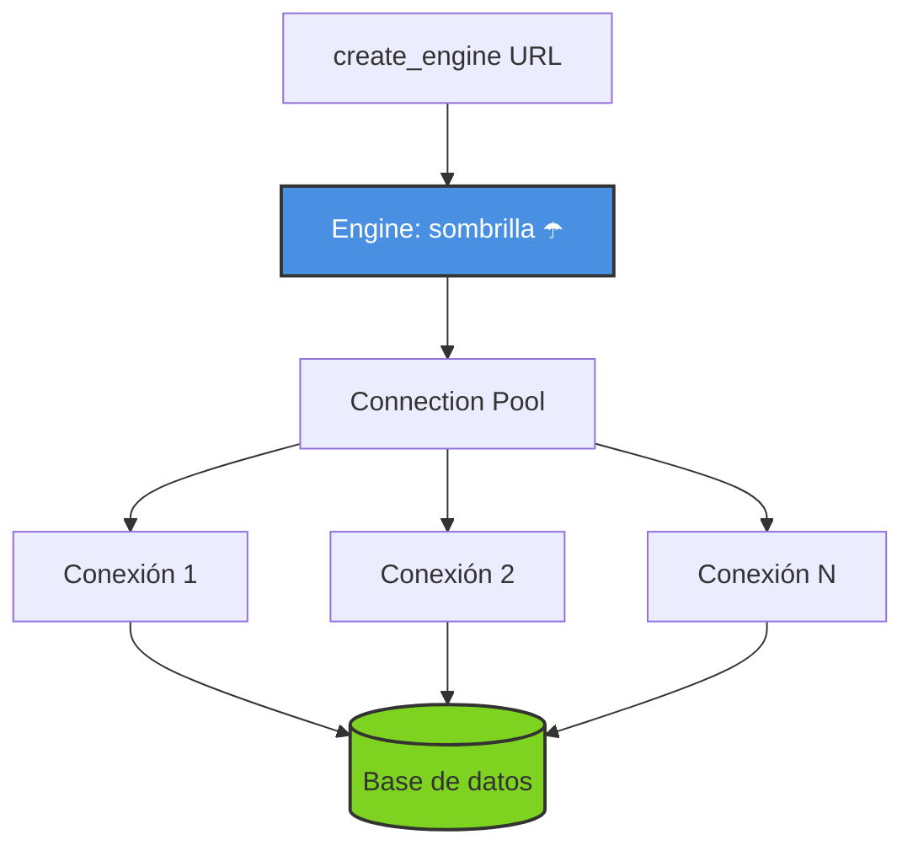
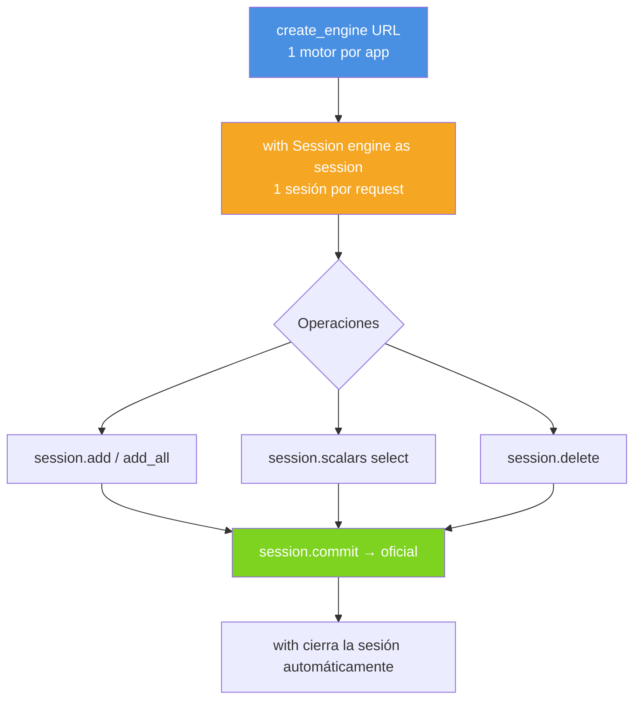

# Capítulo 4: Engine y Session — el corazón de SQLAlchemy

> Dos objetos que necesitarás conocer como la palma de tu mano.

Toda la comunicación con la base de datos pasa por dos piezas. Si las entendés bien, el resto es composición.

---

## 4.1 El `Engine`: la fábrica de conexiones

```python
from sqlalchemy import create_engine

engine = create_engine("sqlite:///:memory:", echo=True)
```

¿Qué está pasando aquí?

- **`create_engine(...)`** crea un motor. NO abre una conexión todavía, solo se prepara.
- **`echo=True`** le dice que imprima en consola todo el SQL que genere. Es un bisturí perfecto para aprender. En producción, se quita.

Piénsalo así: `Engine` es una **sombrilla** ☂️ que sabe cómo hablar con tu base de datos y guarda las conexiones en una *pool* (grupo de conexiones reutilizables).

### Anatomía del Engine



> 🎓 **El Engine es el punto único de entrada.** Cuando tu código necesita la DB, le pide al Engine; este le da una conexión del pool (que se reutiliza para no abrir una nueva cada vez).

### Opciones útiles del Engine

```python
engine = create_engine(
    "sqlite:///./mi_base.db",
    echo=False,                          # en producción, FALSE
    pool_size=5,                          # 5 conexiones simultáneas (PostgreSQL, MySQL)
    max_overflow=10,                      # hasta 15 conexiones bajo carga pico
    pool_pre_ping=True,                   # detecta conexiones muertas antes de usarlas
    pool_recycle=3600,                    # recicla conexiones cada hora (evita timeouts)
    connect_args={"check_same_thread": False}  # necesario para SQLite + FastAPI
)
```

| Parámetro | Para qué sirve |
|---|---|
| `echo` | Imprime SQL por consola (sólo desarrollo). |
| `pool_size` | Conexiones mínimas que quedan abiertas. |
| `pool_pre_ping` | Antes de usar, hace un `SELECT 1` para verificar. |
| `pool_recycle` | Tiempo máximo de vida de una conexión (segundos). |
| `connect_args` | Parámetros específicos del driver (ej: `check_same_thread` para SQLite). |

> 🎓 **Consejo del profesor**: para empezar, `echo=True` y todo lo demás por defecto. Sumá ajustes solo cuando los necesites.

---

## 4.2 Probar el Engine con un `text()`

Para confirmar que el motor habla bien con la base, podemos enviar un SELECT crudo usando `text()`:

```python
from sqlalchemy import create_engine, text

engine = create_engine("sqlite:///:memory:")

with engine.connect() as conn:
    result = conn.execute(text("SELECT 1 + 1 AS suma"))
    print(result.scalar())  # -> 2
```

> ⚠️ `text()` se usa solo para SQL crudo. En el capítulo 12 aprenderemos la forma moderna (`select()`).

---

## 4.3 La `Session`: tu "conversación" con la base

La `Session` es donde harás casi todo tu trabajo. Representa una **conversación** entre tu código y la base de datos.

```python
from sqlalchemy.orm import Session

session = Session(engine)
# ...trabajo...
session.close()
```

Pero ese patrón es anticuado. La forma **moderna** es con un *context manager* (`with`):

```python
with Session(engine) as session:
    # todo lo que hagas aquí dentro vive en una sola transacción
    session.add(...)
    session.commit()
# cuando salís del with, la sesión se cierra automáticamente
```

> 🎓 **Mental model**: pensá en `Session` como una **charla privada** 📞 con la base de datos. Cada `commit()` es como decir "ok, lo que hablamos hasta ahora se hizo oficial". Si salís sin `commit()`, todo se descarta (rollback).

---

## 4.4 Ciclo de vida de una sesión

| Estado | Qué pasa |
|---|---|
| **Abierta** | Acepta operaciones (`add`, `delete`, `query`). Tiene una transacción implícita. |
| **Modificada (dirty)** | Tiene cambios pendientes que aún no se enviaron a la base. |
| **Commit** | Envía `INSERT/UPDATE/DELETE` y hace los cambios oficiales y permanentes. |
| **Rollback** | Revierte todo lo que se hizo dentro de la sesión. |
| **Cerrada** | Libera la conexión. |

> 💡 **Regla de oro**: una `Session` **no es thread-safe**. No la compartas entre hilos. Cada thread/request debe tener la suya.

---

## 4.5 Patrones de uso (de menos a más moderno)

### ❌ Patrón 1 — Manual (nunca lo hagas)

```python
session = Session(engine)
try:
    usuario = Usuario(nombre="Ana")
    session.add(usuario)
    session.commit()
finally:
    session.close()
```

**Problema**: si olvidás el `close()`, se filtra una conexión.

### 🟡 Patrón 2 — Context manager (`with`)

```python
with Session(engine) as session:
    usuario = Usuario(nombre="Ana")
    session.add(usuario)
    session.commit()
```

✅ Más limpio. El `with` se encarga del cierre.

### 🟢 Patrón 3 — `yield` (ideal para FastAPI)

```python
def get_db():
    with Session(engine) as session:
        yield session
```

✅ **El más elegante**: combina seguridad (`with` interno) y compatibilidad con FastAPI (`yield`). Lo veremos a fondo en el [capítulo 17](./17-fastapi.md).

---

## 4.6 Métodos principales de la `Session`

Estos son los que vas a usar **el 95% del tiempo**:

| Método | Para qué sirve | Devuelve |
|---|---|---|
| `session.add(obj)` | Marca un objeto nuevo para `INSERT`. | `None` |
| `session.add_all([obj1, obj2])` | Múltiples `add` en una lista. | `None` |
| `session.commit()` | Flush + commit. Hace oficiales los cambios. | `None` |
| `session.rollback()` | Revierte cambios no confirmados. | `None` |
| `session.flush()` | Emite SQL pendiente **sin commitear**. | `None` |
| `session.refresh(obj)` | Recarga el objeto desde la DB. | `None` |
| `session.get(Model, id)` | Busca por PK. | Instancia o `None`. |
| `session.scalars(stmt)` | Ejecuta un `select` y devuelve iterable de objetos. | `ScalarResult` |
| `session.execute(stmt)` | Ejecuta cualquier statement, devuelve filas. | `Result` |
| `session.delete(obj)` | Marca para `DELETE`. Se ejecuta en `flush/commit`. | `None` |
| `session.close()` | Cierra la sesión. | `None` |

---

## 4.7 ¿Qué es el `flush` vs el `commit`?

Es una de las confusiones más comunes.

- 🌊 **`flush()`**: SQLAlchemy envía los `INSERT/UPDATE/DELETE` a la base. La transacción **sigue abierta**.
- ✅ **`commit()`**: además de hacer flush, marca la transacción como **oficial** y la cierra.

```
flush   →  la base YA tiene los cambios, podés seguís operando
commit  →  la base CONFIRMA los cambios, se cierra la transacción
```

```python
with Session(engine) as session:
    usuario = Usuario(nombre="Ana")
    session.add(usuario)
    session.flush()        # SQL emitido: 'INSERT INTO usuarios ...'
    print(usuario.id)      # ya tiene el id generado
    
    usuario.nombre = "Anabel"  
    session.commit()       # SQL emitido: 'UPDATE usuarios SET nombre=...'
    # TRANSACCIÓN CERRADA ✅
```

> 💡 Si salís del `with` sin hacer `commit()`, se hace `rollback()` automático: **se pierden los cambios**.

---

## 4.8 Mini-resumen visual



---

## 🛠️ Ejercicios prácticos

### 🟢 Ejercicio 4.1: Tu primer engine

Creá un script `mi_primer_engine.py` que:

1. Cree un engine de SQLite en memoria con `echo=True`.
2. Ejecute un `SELECT 1 + 1` usando `text()`.
3. Imprima el resultado.

**Pista**: mirá la sección [4.2](#42-probar-el-engine-con-un-text) del capítulo.

**Solución**: [soluciones/04-engine-session.md](../soluciones/04-engine-session.md#ejercicio-41)

---

### 🟢 Ejercicio 4.2: Pool de conexiones

Investigá y respondé:

1. ¿Qué pasa si creás 3 `engine = create_engine(...)` con la misma URL en tu app?
2. ¿Tiene sentido tener más de un Engine en una aplicación FastAPI?

**Solución**: [soluciones/04-engine-session.md](../soluciones/04-engine-session.md#ejercicio-42)

---

### 🟡 Ejercicio 4.3: Detectá un bug

Este código tiene **dos errores** comunes. Encontralos:

```python
from sqlalchemy import create_engine
from sqlalchemy.orm import Session

engine = create_engine("sqlite:///./mi_app.db")

def agregar_usuario(nombre, email):
    session = Session(engine)
    usuario = Usuario(nombre=nombre, email=email)
    session.add(usuario)
    session.commit()
    session.close()
    return usuario.id
```

1. Identificá los problemas.
2. Reescribilo usando el patrón `with` recomendado.
3. ¿Qué pasa si `commit()` lanza una excepción?

**Solución**: [soluciones/04-engine-session.md](../soluciones/04-engine-session.md#ejercicio-43)

---

### 🟡 Ejercicio 4.4: Comparar `flush` vs `commit`

Escribí un script que demuestre la diferencia entre `flush()` y `commit()`:

1. Creá un objeto `Usuario`.
2. Hacé `session.add()` + `session.flush()`.
3. Imprimí el `id` (¿está disponible?).
4. Modificá el nombre.
5. Hacé `session.commit()`.
6. Abrí otra sesión y verificá que el cambio está persistido.

**Solución**: [soluciones/04-engine-session.md](../soluciones/04-engine-session.md#ejercicio-44)

---

### 🔴 Ejercicio 4.5: Manejo de errores transaccionales

Escribí una función `transferir_dinero(origen_id, destino_id, monto)` que:

1. Reste `monto` al usuario origen.
2. Sume `monto` al usuario destino.
3. Si el origen no tiene saldo suficiente, haga rollback y retorne `False`.
4. Si todo va bien, retorne `True`.

**Restricciones**:
- Usá `try/except` correctamente.
- La transacción debe ser **atómica** (o ambas operaciones o ninguna).

**Solución**: [soluciones/04-engine-session.md](../soluciones/04-engine-session.md#ejercicio-45)

---

## 🎓 Lo que aprendiste

- `Engine` es una fábrica de conexiones (una por aplicación).
- `Session` es una conversación con la base (una por request).
- Usa siempre `with Session(engine) as session:`.
- `flush()` emite SQL pero no cierra la transacción.
- `commit()` sí la cierra y hace los cambios oficiales.

## 📖 Siguiente

[Capítulo 5: Declarative Base →](./05-declarative-base.md)
