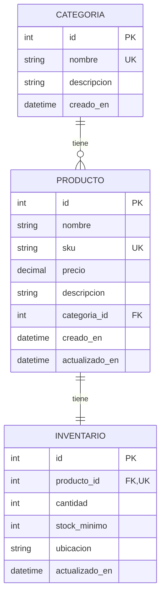

# Capítulo 9: El primer modelo completo

> Ahora vamos a unir todo lo que aprendimos en un ejemplo realista.

---

## 9.1 El dominio: una pequeña tienda online

Vamos a modelar:

- 📦 **Productos**: lo que se vende.
- 🏷️ **Categorías**: agrupan productos.
- 📊 **Inventario**: stock disponible.

> 🎓 **Analogía**: pensá en una tienda física con estantes. Las estanterías son las **Categorías**, cada objeto es un **Producto**, y la cantidad disponible está en el **Inventario**.

---

## 9.2 El código completo

```python
# src/models.py
from datetime import datetime
from typing import Optional
from sqlalchemy import String, Numeric, Integer, ForeignKey, func, Index
from sqlalchemy.orm import DeclarativeBase, Mapped, mapped_column, relationship


class Base(DeclarativeBase):
    pass


class Categoria(Base):
    __tablename__ = "categorias"

    id: Mapped[int] = mapped_column(primary_key=True)
    nombre: Mapped[str] = mapped_column(String(50), unique=True, index=True)
    descripcion: Mapped[Optional[str]] = mapped_column(default=None)

    # relación 1—N con Producto
    productos: Mapped[list["Producto"]] = relationship(
        back_populates="categoria",
        cascade="all, delete-orphan",
    )

    # columnas de auditoría
    creado_en: Mapped[datetime] = mapped_column(server_default=func.now())

    def __repr__(self):
        return f"Categoria(id={self.id}, nombre={self.nombre!r})"


class Producto(Base):
    __tablename__ = "productos"

    id: Mapped[int] = mapped_column(primary_key=True)
    nombre: Mapped[str] = mapped_column(String(100), index=True)
    sku: Mapped[str] = mapped_column(String(20), unique=True)
    precio: Mapped[float] = mapped_column(Numeric(10, 2))
    descripcion: Mapped[Optional[str]] = mapped_column(default=None)

    # FK hacia categoría
    categoria_id: Mapped[Optional[int]] = mapped_column(
        ForeignKey("categorias.id"), default=None
    )

    # relación N—1 con Categoria
    categoria: Mapped[Optional["Categoria"]] = relationship(
        back_populates="productos"
    )

    # relación 1—1 con Inventario
    inventario: Mapped[Optional["Inventario"]] = relationship(
        back_populates="producto",
        uselist=False,
        cascade="all, delete-orphan",
    )

    creado_en: Mapped[datetime] = mapped_column(server_default=func.now())
    actualizado_en: Mapped[datetime] = mapped_column(
        server_default=func.now(),
        onupdate=func.now(),
    )

    __table_args__ = (
        Index("ix_producto_precio", "precio"),  # acelera filtros por rango
    )

    def __repr__(self):
        return (
            f"Producto(id={self.id}, nombre={self.nombre!r}, "
            f"precio={self.precio})"
        )


class Inventario(Base):
    __tablename__ = "inventarios"

    id: Mapped[int] = mapped_column(primary_key=True)

    # FK única: solo UN inventario por producto
    producto_id: Mapped[int] = mapped_column(
        ForeignKey("productos.id"), unique=True
    )

    cantidad: Mapped[int] = mapped_column(Integer, default=0, nullable=False)
    stock_minimo: Mapped[int] = mapped_column(Integer, default=5)
    ubicacion: Mapped[Optional[str]] = mapped_column(String(50), default=None)

    producto: Mapped["Producto"] = relationship(
        back_populates="inventario", uselist=False
    )

    actualizado_en: Mapped[datetime] = mapped_column(
        server_default=func.now(),
        onupdate=func.now(),
    )

    def __repr__(self):
        return f"Inventario(id={self.id}, cantidad={self.cantidad})"
```

---

## 9.3 Qué genera este modelo en SQL

Cuando hagamos `Base.metadata.create_all(engine)` se emitirá:

```sql
CREATE TABLE categorias (
    id INTEGER NOT NULL PRIMARY KEY,
    nombre VARCHAR(50) NOT NULL UNIQUE,
    descripcion VARCHAR,
    creado_en DATETIME DEFAULT CURRENT_TIMESTAMP
);

CREATE UNIQUE INDEX ix_categorias_nombre ON categorias (nombre);

CREATE TABLE productos (
    id INTEGER NOT NULL PRIMARY KEY,
    nombre VARCHAR(100) NOT NULL,
    sku VARCHAR(20) NOT NULL UNIQUE,
    precio NUMERIC(10, 2) NOT NULL,
    descripcion VARCHAR,
    categoria_id INTEGER,
    creado_en DATETIME DEFAULT CURRENT_TIMESTAMP,
    actualizado_en DATETIME DEFAULT CURRENT_TIMESTAMP,
    FOREIGN KEY(categoria_id) REFERENCES categorias (id)
);

CREATE INDEX ix_productos_nombre ON productos (nombre);
CREATE INDEX ix_producto_precio ON productos (precio);

CREATE TABLE inventarios (
    id INTEGER NOT NULL PRIMARY KEY,
    producto_id INTEGER NOT NULL UNIQUE,
    cantidad INTEGER NOT NULL DEFAULT 0,
    stock_minimo INTEGER NOT NULL DEFAULT 5,
    ubicacion VARCHAR(50),
    actualizado_en DATETIME DEFAULT CURRENT_TIMESTAMP,
    FOREIGN KEY(producto_id) REFERENCES productos (id)
);
```

¡Y no escribimos ni una línea de SQL! 🎩

---

## 9.4 Desgranando las decisiones del modelo

### En `Categoria`

```python
nombre: Mapped[str] = mapped_column(String(50), unique=True, index=True)
```

- `String(50)`: VARCHAR(50).
- `unique=True`: no se repiten categorías con el mismo nombre.
- `index=True`: crea un índice, acelera búsquedas por nombre.

### En `Producto`

```python
categoria_id: Mapped[Optional[int]] = mapped_column(ForeignKey("categorias.id"), default=None)
categoria: Mapped[Optional["Categoria"]] = relationship(back_populates="productos")
```

- La FK permite `NULL` (un producto puede no tener categoría).
- `relationship` permite navegar `producto.categoria` desde Python.

### En `Inventario`

```python
producto_id: Mapped[int] = mapped_column(ForeignKey("productos.id"), unique=True)
```

- `unique=True`: solo puede haber UN inventario por producto.
- Combinado con `uselist=False`, define una relación **1 — 1**.

### En `actualizado_en`

```python
actualizado_en: Mapped[datetime] = mapped_column(
    server_default=func.now(),
    onupdate=func.now(),
)
```

- Se inicializa con la fecha actual.
- Se actualiza automáticamente en cada `UPDATE`.

---

## 9.5 Verificar el modelo visualmente

Antes de seguir, podemos ver el diagrama lógico:



> 🎓 Leyenda: `||--o{` significa "uno a muchos", `||--||` es "uno a uno". `PK` = Primary Key, `UK` = Unique Key, `FK` = Foreign Key.

---

## 🛠️ Ejercicios prácticos

### 🟢 Ejercicio 9.1: Extender el modelo

Sumá al modelo `Producto`:

1. Un campo `stock: int` con default `0` y `nullable=False`.
2. Un campo `tags: list[str] | None` (usando `JSON` para serializar).
3. Un índice en el campo `nombre`.

**Solución**: [soluciones/09-primer-modelo.md](../soluciones/09-primer-modelo.md#ejercicio-91)

---

### 🟢 Ejercicio 9.2: Generar el SQL

Para el modelo de Producto del ejercicio 9.1:

1. Escribí el SQL que creés que generaría SQLAlchemy.
2. Después, hacé `Base.metadata.create_all(engine)` con `echo=True`.
3. Compará tu predicción con la realidad.

**Solución**: [soluciones/09-primer-modelo.md](../soluciones/09-primer-modelo.md#ejercicio-92)

---

### 🟡 Ejercicio 9.3: Tabla de unión

Agregá una entidad `Proveedor` que:

- Tenga `id`, `nombre`, `email`, `telefono` (puede ser NULL).
- Un producto pueda tener varios proveedores (N—M).
- Un proveedor pueda tener varios productos.

Modelá las tablas y relaciones.

**Solución**: [soluciones/09-primer-modelo.md](../soluciones/09-primer-modelo.md#ejercicio-93)

---

### 🟡 Ejercicio 9.4: Self-reference en Categoria

Modificá `Categoria` para que pueda tener subcategorías (autorreferencia):

- Campo `padre_id` opcional (FK a sí misma).
- Relación `padre` y `hijas`.

**Solución**: [soluciones/09-primer-modelo.md](../soluciones/09-primer-modelo.md#ejercicio-94)

---

### 🔴 Ejercicio 9.5: Diseño completo

Diseñá el esquema completo de una **biblioteca**:

- `Libro` (título, ISBN único, año, autor_id).
- `Autor` (nombre, biografía).
- `Socio` (nombre, email, fecha_registro).
- `Prestamo` (libro_id, socio_id, fecha_prestamo, fecha_devolucion).

Incluí todas las relaciones, índices y restricciones que consideres necesarias.

**Solución**: [soluciones/09-primer-modelo.md](../soluciones/09-primer-modelo.md#ejercicio-95)

---

## 🎓 Lo que aprendiste

- Combinamos 1—N (Categoria—Producto), 1—1 (Producto—Inventario) y columnas de auditoría.
- `Index`, `Unique`, `ForeignKey` se pasan directo a `mapped_column`.
- `unique=True` + `uselist=False` = relación 1—1.
- `server_default=func.now()` y `onupdate=func.now()` gestionan timestamps automáticamente.
- El SQL generado por SQLAlchemy es **limpio y bien normalizado**.

## 📖 Siguiente

[Capítulo 10: Crear las tablas en la base de datos →](./10-crear-tablas.md)