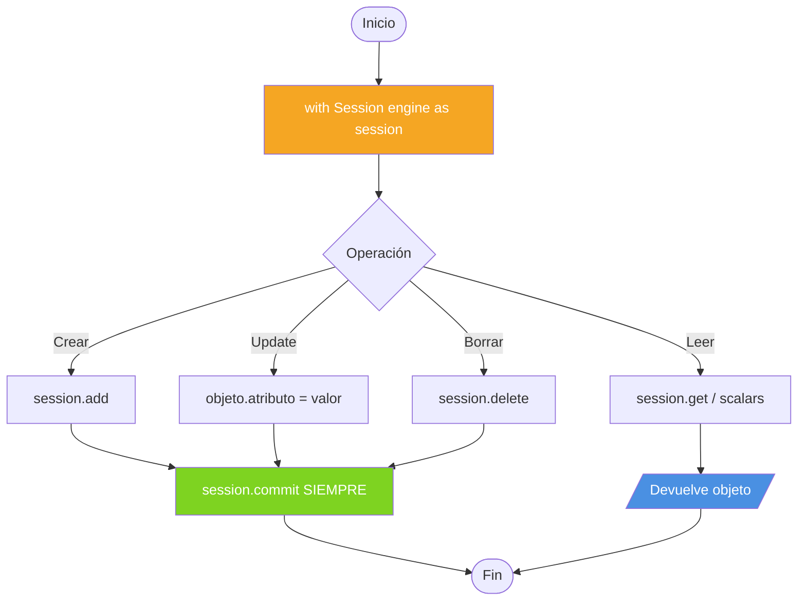

# Capítulo 11: CRUD — Crear, Leer, Actualizar, Borrar

> Las cuatro operaciones que vas a hacer el 95% del tiempo. CRUD = Create, Read, Update, Delete.

Vamos a verlas con nuestro modelo `Producto` (definido en el [capítulo 9](./09-primer-modelo.md)).

---

## 11.1 CREATE — Agregar datos

### Insertar un objeto a la vez

```python
from sqlalchemy.orm import Session
from src.models import Producto, Categoria, Inventario

with Session(engine) as session:
    nuevo = Producto(
        nombre="Cafetera",
        sku="CF-001",
        precio=8500.50,
        descripcion="Cafetera espresso con wifi",
    )
    session.add(nuevo)
    session.commit()  # 💡 sin commit, no se persiste
```

### Insertar múltiples en una lista (más eficiente)

```python
with Session(engine) as session:
    productos = [
        Producto(nombre="Micrófono", sku="MIC-002", precio=12000),
        Producto(nombre="Auriculares", sku="AUR-003", precio=9500),
        Producto(nombre="Parlante", sku="PAR-004", precio=8500),
    ]
    session.add_all(productos)
    session.commit()
```

### Insertar objetos relacionados (relaciones anidadas)

Cuando tenés una relación configurada, podés crear todo de una:

```python
with Session(engine) as session:
    electronica = Categoria(nombre="Electrónica")
    nuevo = Producto(
        nombre="Tablet",
        sku="TAB-005",
        precio=35000,
        categoria=electronica,
        inventario=Inventario(cantidad=10, ubicacion="Estantería A1"),
    )
    session.add(nuevo)
    session.commit()
    print(nuevo.id)              # ya tiene el id
    print(nuevo.creado_en)       # timestamp generado por la base
```

> 🎓 **Magia**: SQLAlchemy detecta la relación, hace `INSERT` en las dos tablas y los conecta por FK.

---

## 11.2 READ — Leer datos

### Opción 1: por Primary Key (la más rápida)

```python
with Session(engine) as session:
    producto = session.get(Producto, 1)
    if producto:
        print(producto)
    else:
        print("No existe")
```

### Opción 2: SELECT con WHERE (la más flexible)

```python
from sqlalchemy import select

with Session(engine) as session:
    stmt = select(Producto).where(Producto.nombre == "Cafetera")
    resultado = session.scalars(stmt).first()
    print(resultado)
```

### Opciones del resultado

```python
stmt = select(Producto).where(Producto.precio > 1000)

# Devuelve el primero o None
p = session.scalars(stmt).first()

# Devuelve un único resultado (falla si hay 0 o más de 1)
p = session.scalars(stmt).one()

# Devuelve uno o None
p = session.scalars(stmt).one_or_none()

# Devuelve TODOS los resultados en una lista
todos = session.scalars(stmt).all()
```

| Método | Si no hay resultados | Si hay varios |
|---|---|---|
| `.first()` | `None` | El primero |
| `.one()` | `NoResultFound` | `MultipleResultsFound` |
| `.one_or_none()` | `None` | `MultipleResultsFound` |
| `.all()` | `[]` | Todos en lista |

> 🎓 **Consejo**: para endpoints REST, lo más común es `.first()` o `session.get()`.

### Contar sin traer los datos

```python
from sqlalchemy import func

with Session(engine) as session:
    total = session.scalar(select(func.count(Producto.id)))
    print(f"Total: {total}")
```

---

## 11.3 UPDATE — Actualizar datos

### Forma moderna: cambiar atributos y commit

```python
with Session(engine) as session:
    producto = session.get(Producto, 1)
    if producto:
        producto.precio = 9999.99
        producto.descripcion = "Cafetera con bluetooth"
        session.commit()
    else:
        session.rollback()
```

> 🧠 **Magia**: SQLAlchemy detecta los cambios automáticamente. No hace falta llamar a `session.update(...)`.

### UPDATE directo con SQL (sin tocar objetos)

A veces querés actualizar muchas filas a la vez sin traerlas. Para eso, `update()`:

```python
from sqlalchemy import update

with Session(engine) as session:
    stmt = (
        update(Producto)
        .where(Producto.sku.like("CF-%"))
        .values(precio=9999.99, descripcion="Oferta")
    )
    session.execute(stmt)
    session.commit()
```

> 💡 **Cuándo usar `update()` directo**: para ajustes masivos (ej: bajar todos los precios un 10%). Es 100x más rápido que traer todas las filas.

### Ejemplo: update masivo con función

```python
from sqlalchemy import update, func

with Session(engine) as session:
    stmt = (
        update(Producto)
        .where(Producto.categoria_id == 1)
        .values(precio=Producto.precio * 0.9)  # descuento del 10%
    )
    session.execute(stmt)
    session.commit()
```

---

## 11.4 DELETE — Borrar datos

### Borrar un objeto (a partir de su instancia)

```python
with Session(engine) as session:
    producto = session.get(Producto, 1)
    if producto:
        session.delete(producto)
        session.commit()
```

> ⚠️ El `DELETE` real se emite en el `flush/commit`. Hasta entonces, podés "volver atrás" haciendo `session.rollback()`.

### DELETE directo por condición

```python
from sqlalchemy import delete

with Session(engine) as session:
    stmt = delete(Producto).where(Producto.sku.like("DESCATALOGADO-%"))
    session.execute(stmt)
    session.commit()
```

> 💡 Más rápido que traer todos los objetos y borrarlos uno a uno.

### Borrar con cascade (la forma correcta)

Si tenés `cascade="all, delete-orphan"` en una relación, al borrar el padre, **los hijos se borran también automáticamente**.

```python
with Session(engine) as session:
    categoria = session.get(Categoria, 1)
    session.delete(categoria)  # 👈 también borra todos los productos de esa categoría
    session.commit()
```

---

## 11.5 `session.refresh()`: recargar desde la base

Útil cuando querés que tu objeto refleje cambios que se hicieron a nivel de base (por ejemplo, columnas autogeneradas):

```python
with Session(engine) as session:
    nuevo = Producto(nombre="Mouse", sku="MOU-006", precio=2000)
    session.add(nuevo)
    session.flush()                  # emite INSERT, genera id

    print(nuevo.creado_en)           # podría no estar cargado todavía
    session.refresh(nuevo)           # SELECT FROM productos WHERE id=...
    print(nuevo.creado_en)           # ahora sí
```

O directamente:

```python
session.add(nuevo)
session.commit()
session.refresh(nuevo)               # SELECT para traer todo
```

---

## 11.6 Patrón completo de CRUD

```python
# src/repositories/productos.py
from typing import List, Optional
from sqlalchemy import select, update, delete
from sqlalchemy.orm import Session
from src.models import Producto


class ProductoRepository:
    """Encapsula las operaciones de Producto en una clase."""
    
    def __init__(self, session: Session):
        self.session = session
    
    def crear(self, **kwargs) -> Producto:
        producto = Producto(**kwargs)
        self.session.add(producto)
        self.session.commit()
        self.session.refresh(producto)
        return producto
    
    def obtener(self, id: int) -> Optional[Producto]:
        return self.session.get(Producto, id)
    
    def listar(self, skip: int = 0, limit: int = 100) -> List[Producto]:
        stmt = select(Producto).offset(skip).limit(limit)
        return list(self.session.scalars(stmt))
    
    def buscar_por_sku(self, sku: str) -> Optional[Producto]:
        stmt = select(Producto).where(Producto.sku == sku)
        return self.session.scalars(stmt).first()
    
    def actualizar(self, id: int, **kwargs) -> Optional[Producto]:
        producto = self.obtener(id)
        if not producto:
            return None
        for key, value in kwargs.items():
            setattr(producto, key, value)
        self.session.commit()
        self.session.refresh(producto)
        return producto
    
    def eliminar(self, id: int) -> bool:
        producto = self.obtener(id)
        if not producto:
            return False
        self.session.delete(producto)
        self.session.commit()
        return True
```

> 🎓 **Consejo del profesor**: encapsular las queries en un **Repository** te da:
> - ✅ Testeo más fácil (podés mockear el repo).
> - ✅ Reutilización (mismas queries en distintos endpoints).
> - ✅ Mantenimiento (cambias SQL en un solo lugar).

---

## 11.7 Resumen visual del flujo



---

## 🛠️ Ejercicios prácticos

### 🟢 Ejercicio 11.1: Crear y leer

Escribí un script que:

1. Cree 3 productos con `add_all()`.
2. Haga `commit()`.
3. Los lea con `session.get(Producto, 1)` y los imprima.

**Solución**: [soluciones/11-crud.md](../soluciones/11-crud.md#ejercicio-111)

---

### 🟡 Ejercicio 11.2: UPDATE masivo

Usando `update()` directo (no a nivel de objeto), aumentá un 15% el precio de **todos** los productos que cuestan menos de 1000.

```python
# Tu código acá
```

**Solución**: [soluciones/11-crud.md](../soluciones/11-crud.md#ejercicio-112)

---

### 🟡 Ejercicio 11.3: DELETE con verificación

Escribí una función `eliminar_si_existe(session, id)` que:

- Si el producto existe, lo borre y retorne `True`.
- Si no existe, retorne `False`.
- Use `try/except` para manejar errores.

**Solución**: [soluciones/11-crud.md](../soluciones/11-crud.md#ejercicio-113)

---

### 🟡 Ejercicio 11.4: Patrón Repository

Implementá un `ClienteRepository` (similar al `ProductoRepository` del capítulo) con métodos:

- `crear(nombre, email, saldo=0)`.
- `obtener(id)`.
- `listar(skip, limit)`.
- `actualizar_saldo(id, nuevo_saldo)` (con validación: no permitir saldo negativo).

**Solución**: [soluciones/11-crud.md](../soluciones/11-crud.md#ejercicio-114)

---

### 🔴 Ejercicio 11.5: Transacción atómica

Escribí una función `transferir_stock(origen_id, destino_id, cantidad)` que:

- Reste `cantidad` del stock de `origen`.
- Sume `cantidad` al stock de `destino`.
- Si `origen.stock < cantidad`, hacer rollback y retornar `False`.
- Si todo va bien, retornar `True`.

Garantizá atomicidad.

**Solución**: [soluciones/11-crud.md](../soluciones/11-crud.md#ejercicio-115)

---

## 🎓 Lo que aprendiste

---

## 🎓 Lo que aprendiste

- `session.add()` / `session.add_all()` para INSERT.
- `session.get(Modelo, pk)` para búsquedas rápidas.
- `session.scalars(select(...))` para queries flexibles.
- Modificar atributos es suficiente para UPDATE; `commit()` lo emite.
- `session.delete()` es para DELETE; se ejecuta en `flush/commit`.
- `update()` y `delete()` directo son eficientes para masivas.

## 📖 Siguiente

[Capítulo 12: Consultas (`SELECT`, `WHERE`, `JOIN`) →](./12-consultas.md)