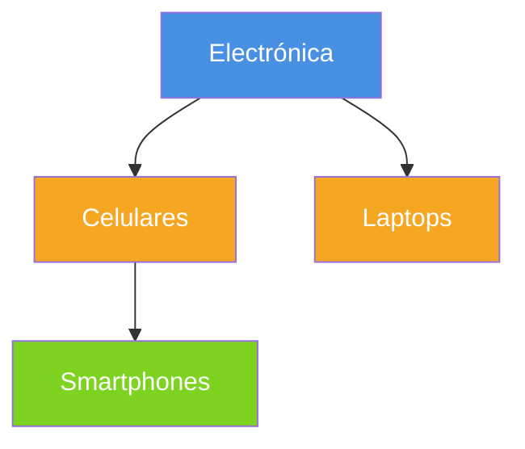
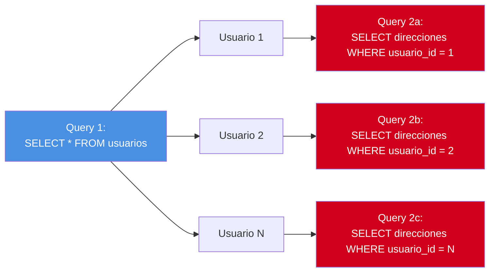

# Capítulo 13: Relaciones entre tablas — lo que nadie te explica bien

> Si entendés este capítulo, entendés el 70% de SQLAlchemy.

Este es el capítulo más importante. Si dominás las relaciones, podés modelar **cualquier cosa**.

---

## 13.1 Un poquito de teoría relacional

Antes de escribir código, asegurate de tener clara esta idea:

- 📚 **Tabla "padre"**: la que contiene la *primary key* referenciada.
- 📂 **Tabla "hija"**: la que contiene el *foreign key* apuntando al padre.

**Ejemplo real**: un `Usuario` tiene muchas `Direcciones`. La tabla `direcciones` lleva una columna `usuario_id` apuntando a `usuarios.id`. La "hija" es `direcciones`, la "padre" es `usuarios`.

> 🎓 **Analogía del profesor**: pensá en un árbol genealógico. El papá tiene uno o varios hijos. Cada hijo conoce quién es su papá (FK). Pero **además** podés preguntar al papá "¿quiénes son tus hijos?" y te los dice. Esa doble navegación la construyen las relaciones en SQLAlchemy.

### Cardinalidades

| Cardinalidad | Una fila de A se relaciona con... | Un ejemplo |
|---|---|---|
| **1 — N (uno a muchos)** | muchas filas de B | Usuario → Direcciones |
| **N — 1 (muchos a uno)** | una fila de B (el mismo caso, otra perspectiva) | Dirección → Usuario |
| **1 — 1 (uno a uno)** | exactamente una fila de B | Usuario → Foto de perfil |
| **N — M (muchos a muchos)** | muchas filas de B, y viceversa | Estudiantes ↔ Materias |

---

## 13.2 Uno a muchos (1 — N): el caso clásico

**Escenario**: un usuario puede tener muchas direcciones.

```python
from typing import List
from typing import Optional
from sqlalchemy import ForeignKey, String
from sqlalchemy.orm import DeclarativeBase, Mapped, mapped_column, relationship

class Base(DeclarativeBase):
    pass

class Usuario(Base):
    __tablename__ = "usuarios"

    id: Mapped[int] = mapped_column(primary_key=True)
    nombre: Mapped[str] = mapped_column(String(30))
    fullname: Mapped[Optional[str]]

    # 🔑 la magia: una lista de direcciones
    direcciones: Mapped[List["Direccion"]] = relationship(
        back_populates="usuario",
        cascade="all, delete-orphan",
    )

    def __repr__(self):
        return f"Usuario(id={self.id}, nombre={self.nombre!r})"


class Direccion(Base):
    __tablename__ = "direcciones"

    id: Mapped[int] = mapped_column(primary_key=True)
    email_address: Mapped[str]

    # FK hacia la tabla "padre"
    usuario_id: Mapped[int] = mapped_column(ForeignKey("usuarios.id"))

    # 🔑 la otra cara de la moneda
    usuario: Mapped["Usuario"] = relationship(back_populates="direcciones")

    def __repr__(self):
        return f"Direccion(id={self.id}, email={self.email_address!r})"
```

### Desmenuzando el ejemplo

**Lado del padre (`Usuario`)**:

```python
direcciones: Mapped[List["Direccion"]] = relationship(
    back_populates="usuario",
    cascade="all, delete-orphan",
)
```

- `Mapped[List["Direccion"]]` → "puede tener una lista de direcciones".
- `back_populates="usuario"` → "si en Direccion tenés un atributo `usuario`, sincronizá ambos lados".
- `cascade="all, delete-orphan"` → si borrás al usuario, se borran sus direcciones (lo detallamos más abajo).

**Lado del hijo (`Direccion`)**:

```python
usuario_id: Mapped[int] = mapped_column(ForeignKey("usuarios.id"))
usuario: Mapped["Usuario"] = relationship(back_populates="direcciones")
```

- `ForeignKey("usuarios.id")` → a nivel SQL, esta columna apunta a `usuarios.id`.
- `usuario: Mapped["Usuario"]` → a nivel Python, podés hacer `direccion.usuario` y te da el usuario asociado.

> 💡 Las comillas (`"Direccion"`) en `Mapped[List["Direccion"]]` se llaman **forward references**: le decimos a Python "esa clase existe, aunque aún no la haya leído".

### Usando la relación

```python
with Session(engine) as session:
    # crear todo junto
    bob = Usuario(
        nombre="bob",
        fullname="Bob Esponja",
        direcciones=[
            Direccion(email_address="bob@mar.com"),
            Direccion(email_address="bob@hogar.com"),
        ],
    )
    session.add(bob)
    session.commit()

    # navegar de padre a hijo
    bob = session.get(Usuario, 1)
    print(bob.direcciones)   # [<Direccion ...>, <Direccion ...>]
    for d in bob.direcciones:
        print(d.email_address)

    # navegar de hijo a padre
    primera_direccion = session.get(Direccion, 1)
    print(primera_direccion.usuario.nombre)  # "bob"
```

### Agregar más hijos dinámicamente

```python
with Session(engine) as session:
    bob = session.get(Usuario, 1)
    bob.direcciones.append(Direccion(email_address="bob@nuevo.com"))
    session.commit()
```

¡No hace falta `session.add()` para la nueva dirección! SQLAlchemy lo infiere al estar vinculada a un objeto existente.

---

## 13.3 Muchos a uno (N — 1): la vista desde el hijo

Es **exactamente lo mismo** que 1—N. Es solo una cuestión de perspectiva.

```python
class Comentario(Base):
    __tablename__ = "comentarios"

    id: Mapped[int] = mapped_column(primary_key=True)
    texto: Mapped[str]

    usuario_id: Mapped[int] = mapped_column(ForeignKey("usuarios.id"))
    usuario: Mapped["Usuario"] = relationship(back_populates="comentarios")


# en Usuario:
class Usuario(Base):
    # ...
    comentarios: Mapped[List["Comentario"]] = relationship(
        back_populates="usuario", cascade="all, delete-orphan"
    )
```

- Desde `Comentario.usuario` → es **N — 1**.
- Desde `Usuario.comentarios` → es **1 — N**.

Mismas reglas, dos puntos de vista.

---

## 13.4 Uno a uno (1 — 1)

**Escenario**: cada usuario tiene **una sola** foto de perfil.

```python
class FotoPerfil(Base):
    __tablename__ = "fotos_perfil"

    id: Mapped[int] = mapped_column(primary_key=True)
    url: Mapped[str] = mapped_column(String(255))
    usuario_id: Mapped[int] = mapped_column(
        ForeignKey("usuarios.id"), unique=True   # 👈 clave única
    )

    usuario: Mapped["Usuario"] = relationship(
        back_populates="foto_perfil", uselist=False  # 👈 no es lista
    )


class Usuario(Base):
    # ...
    foto_perfil: Mapped["FotoPerfil"] = relationship(
        back_populates="usuario", uselist=False, cascade="all, delete-orphan"
    )
```

**Tres diferencias con 1—N**:

1. `Mapped["FotoPerfil"]` (sin `List`).
2. `uselist=False` (no es una lista, es un solo objeto).
3. `ForeignKey(..., unique=True)` (solo puede haber una fila apuntando).

---

## 13.5 Muchos a muchos (N — M): necesita tabla intermedia

**Escenario**: cada estudiante puede estar en varias materias, y cada materia tiene varios estudiantes. Esto **no se puede modelar con una sola FK**; hace falta una **tabla intermedia**.

### Paso 1: definir la tabla de asociación

```python
from sqlalchemy import Table, Column, ForeignKey, Integer

# Tabla sin modelo ORM propio (es solo SQL)
estudiantes_materias = Table(
    "estudiantes_materias",
    Base.metadata,
    Column("estudiante_id", Integer, ForeignKey("estudiantes.id"), primary_key=True),
    Column("materia_id", Integer, ForeignKey("materias.id"), primary_key=True),
)
```

### Paso 2: definir los modelos con `secondary`

```python
class Estudiante(Base):
    __tablename__ = "estudiantes"

    id: Mapped[int] = mapped_column(primary_key=True)
    nombre: Mapped[str]

    # 👈 "secondary" indica la tabla intermedia
    materias: Mapped[List["Materia"]] = relationship(
        back_populates="estudiantes",
        secondary=estudiantes_materias,
    )


class Materia(Base):
    __tablename__ = "materias"

    id: Mapped[int] = mapped_column(primary_key=True)
    nombre: Mapped[str]

    estudiantes: Mapped[List["Estudiante"]] = relationship(
        back_populates="materias",
        secondary=estudiantes_materias,
    )
```

### Uso

```python
with Session(engine) as session:
    mate = Materia(nombre="Cálculo")
    fede = Estudiante(nombre="Fede", materias=[mate])
    session.add_all([fede, mate])
    session.commit()

    # navegar
    print(mate.estudiantes)   # todos los estudiantes de esta materia
    print(fede.materias)      # todas las materias de Fede
```

> 💡 **Por qué la tabla intermedia**: si la FK fuera en Estudiante, cada Estudiante solo podría tener una Materia. La tabla intermedia permite que un estudiante tenga muchas y una materia tenga muchos.

### Con atributos extra (la relación "con metadata")

A veces querés guardar **datos en la tabla intermedia** (por ejemplo, la fecha en que se anotó). En ese caso, convertila en un modelo:

```python
from datetime import date
from sqlalchemy import Date

class Inscripcion(Base):
    __tablename__ = "inscripciones"

    estudiante_id: Mapped[int] = mapped_column(
        ForeignKey("estudiantes.id"), primary_key=True
    )
    materia_id: Mapped[int] = mapped_column(
        ForeignKey("materias.id"), primary_key=True
    )
    fecha: Mapped[date] = mapped_column(Date)

    estudiante: Mapped["Estudiante"] = relationship(back_populates="inscripciones")
    materia: Mapped["Materia"] = relationship(back_populates="inscripciones")


class Estudiante(Base):
    # ...
    inscripciones: Mapped[List["Inscripcion"]] = relationship(
        back_populates="estudiante", cascade="all, delete-orphan"
    )
    materias: Mapped[List["Materia"]] = relationship(
        secondary="inscripciones",       # nombre en string
        viewonly=True                     # optimiza: no usa el modelo Inscripcion
    )
```

---

## 13.6 Relaciones recursivas (autorreferencias)

**Escenario**: una categoría puede tener subcategorías.

```python
from typing import Optional

class Categoria(Base):
    __tablename__ = "categorias"

    id: Mapped[int] = mapped_column(primary_key=True)
    nombre: Mapped[str]

    # FK hacia la misma tabla
    padre_id: Mapped[Optional[int]] = mapped_column(
        ForeignKey("categorias.id"), default=None
    )

    # la categoría "padre"
    padre: Mapped[Optional["Categoria"]] = relationship(
        back_populates="hijas",
        remote_side="Categoria.id",   # 👈 clave para autorreferencias
    )

    # la lista de subcategorías
    hijas: Mapped[List["Categoria"]] = relationship(
        back_populates="padre",
        cascade="all, delete-orphan",
    )
```

### Diferencia clave: `remote_side`

En una autorreferencia, SQLAlchemy necesita saber cuál lado es el "padre" y cuál el "hijo". `remote_side="Categoria.id"` le dice: "el lado remoto es `id` (el padre)". Sin esto, se confunde.

### Uso: armar un árbol

```python
with Session(engine) as session:
    electronica = Categoria(nombre="Electrónica")
    celulares = Categoria(nombre="Celulares", padre=electronica)
    laptops = Categoria(nombre="Laptops", padre=electronica)
    smartphones = Categoria(nombre="Smartphones", padre=celulares)

    session.add_all([electronica, smartphones])
    session.commit()

    # navegar el árbol
    e = session.get(Categoria, electronica.id)
    for hija in e.hijas:
        print(hija.nombre)
        for nieta in hija.hijas:
            print(f"  └─ {nieta.nombre}")
```



> 🎓 **Analogía**: pensá en el sistema de archivos: cada carpeta tiene un "padre" y muchas "hijas". Esto se llama estructura de árbol.

---

## 13.7 `cascade`, `back_populates`, `backref`: cómo se relacionan

### `back_populates` vs `backref`

Ambas son formas de **conectar ambos lados** de una relación. Son equivalentes, pero diferentes en sintaxis.

**Con `back_populates`** (recomendado, explícito):

```python
class Usuario(Base):
    direcciones: Mapped[List["Direccion"]] = relationship(back_populates="usuario")

class Direccion(Base):
    usuario: Mapped["Usuario"] = relationship(back_populates="direcciones")
```

**Con `backref`** (atajo, compacto):

```python
class Direccion(Base):
    usuario: Mapped["Usuario"] = relationship(backref="direcciones")
# Usuario NO tiene nada sobre direcciones; backref lo crea automáticamente
```

> 🎓 **Diferencia para el profesor**: `back_populates` es como escribir ambas puntas del hilo a mano. `backref` es como decir "dame una pita solita y ya te la armo yo". Para principiantes, `back_populates` es más claro.

| Aspecto | `back_populates` | `backref` |
|---|---|---|
| Explícito | ✅ Ambas clases lo declaran | ❌ Solo en un lado |
| Claridad | ✅ Más legible | 🟠 Más compacto |
| Personalización | ✅ Fácil | 🟠 Más verboso |

---

### `cascade`: qué pasa con los hijos cuando algo le pasa al padre

Esto es **importantísimo** y muchos juniors lo ignoran hasta que rompen cosas. `cascade` define qué operaciones se **propagan** del padre a los hijos.

| Valor | Significado |
|---|---|
| `"save-update"` (default) | Al hacer `session.add(padre)`, agregá los hijos. |
| `"delete"` | Al borrar el padre, se borran los hijos. |
| `"delete-orphan"` | Si un hijo deja de tener padre (se "descongela"), se borra. |
| `"all"` | Combinación de `save-update, merge, refresh-expire, expunge, delete`. |
| `"all, delete-orphan"` | `all` + `delete-orphan` (lo más común). |

### Ejemplo de cascada en acción

```python
class Usuario(Base):
    # ...
    direcciones: Mapped[List["Direccion"]] = relationship(
        back_populates="usuario",
        cascade="all, delete-orphan",   # 👈 esta es la configuración común
    )

with Session(engine) as session:
    u = session.get(Usuario, 1)

    # Al borrar de la lista, se borra de la base
    u.direcciones.remove(u.direcciones[0])   # 👈 delete-orphan
    session.commit()

    # Al borrar al usuario, se borran todas sus direcciones
    session.delete(u)
    session.commit()
```

> ⚠️ **Peligro**: `cascade="all, delete-orphan"` borra físicamente las filas. Si querés un soft delete (marcar como inactivo), usá otros mecanismos.

### `cascade` y `MERGE`

Cuando combinás `all` con `merge()`, podés tener comportamientos raros:

```python
usuario_mergeado = session.merge(usuario_externo)
```

Recomendación: para la mayoría de los casos, **usá `"all, delete-orphan"`** y listo.

---

## 13.8 Estrategias de carga (`lazy`, `joinedload`, `selectinload`)

Cuando hacés `session.get(Usuario, 1)` y luego `usuario.direcciones`, ¿cuándo se ejecuta el SELECT para `direcciones`?

### Lazy loading (carga perezosa, default)

- Si no usás las direcciones, **no se hace la consulta**.
- Si las usás, se hace **un SELECT nuevo** (puede causar N+1).

```python
class Direccion(Base):
    usuario: Mapped["Usuario"] = relationship(back_populates="direcciones")
    # default: lazy="select"
```

### `lazy="joined"`: JOIN automático, **una sola consulta** siempre

```python
usuario: Mapped["Usuario"] = relationship(
    back_populates="direcciones", lazy="joined"
)
```

### `lazy="selectin"`: **una** segunda consulta usando `IN (...)`. Es muy eficiente para listas

```python
usuario: Mapped["Usuario"] = relationship(
    back_populates="direcciones", lazy="selectin"
)
```

### El problema N+1

```python
# 🚫 problema N+1: por cada usuario, hace un SELECT extra
with Session(engine) as session:
    for usuario in session.scalars(select(Usuario)):
        print(usuario.direcciones)   # cada uno dispara su SELECT
```



> 🚨 **N+1**: 1 query principal + N queries extras (uno por cada elemento). Para 1000 usuarios, son 1001 queries totales. **Escala muy mal**.

**Solución con `selectinload`**:

```python
from sqlalchemy.orm import selectinload

with Session(engine) as session:
    stmt = select(Usuario).options(selectinload(Usuario.direcciones))
    for usuario in session.scalars(stmt):
        print(usuario.direcciones)   # solo 2 consultas: una y otra con IN(...)
```

> 🎓 **Consejo profesional**: si ves consultas lentas en tu app, buscá patrones N+1. Es la causa #1 de problemas de rendimiento.

### Tabla resumen de estrategias

| Estrategia | # de queries | Cuándo usarla |
|---|---|---|
| `lazy="select"` (default) | 1 + N | Cuando casi no accedés a la relación. |
| `lazy="joined"` | 1 (con JOIN) | Cuando siempre necesitás el hijo. |
| `lazy="subquery"` | 2 | Similar a joined, pero con subquery. |
| `lazy="selectin"` | 2 (con IN) | Listas. La más eficiente para 1—N. |
| `lazy="raise"` | N/A | Modo estricto: error si accedés sin cargar. |

---

## 13.9 Orderby y lazy loading

Podés definir un orden por defecto en la relación:

```python
class Usuario(Base):
    direcciones: Mapped[List["Direccion"]] = relationship(
        back_populates="usuario",
        order_by="Direccion.email_address",
    )
```

```python
bob = session.get(Usuario, 1)
print(bob.direcciones)  # siempre vienen ordenadas por email_address
```

---

## 13.10 ⚠️ Trampas comunes con relaciones

### Trampa 1: usar el objeto fuera de la sesión

```python
session = Session(engine)
u = session.get(Usuario, 1)
session.close()
print(u.direcciones)   # 💥 DetachedInstanceError
```

**Solución**: usá las relaciones **dentro** del bloque `with`.

### Trampa 2: comparar sin identidad

```python
session.add(Direccion(usuario=usuario_1))
session.commit()

# ⚠️ crea OTRA instancia del mismo registro
mismo_usuario = session.get(Usuario, usuario_1.id)
print(mismo_usuario is usuario_1)  # False (otra instancia)
print(mismo_usuario == usuario_1)  # True (igualdad por PK, gracias al ORM)
```

### Trampa 3: Foreign Key mal escrita

```python
# ❌ Mal: nombre mal de la tabla
usuario_id: Mapped[int] = mapped_column(ForeignKey("Usuario.id"))
# ❌ Mal: columna inexistente
usuario_id: Mapped[int] = mapped_column(ForeignKey("usuarios.email"))

# ✅ Bien: nombre exacto de la tabla y la columna
usuario_id: Mapped[int] = mapped_column(ForeignKey("usuarios.id"))
```

---

## 🛠️ Ejercicios prácticos

### 🟢 Ejercicio 13.1: Relación 1—N

Definí `Editorial` y `Libro` con una relación 1—N. Una editorial tiene muchos libros, un libro pertenece a una editorial.

**Solución**: [soluciones/13-relaciones.md](../soluciones/13-relaciones.md#ejercicio-131)

---

### 🟢 Ejercicio 13.2: Relación 1—1

Definí `Persona` y `Pasaporte` con relación 1—1. Una persona tiene un único pasaporte.

**Pista**: `unique=True` en la FK + `uselist=False` en la relación.

**Solución**: [soluciones/13-relaciones.md](../soluciones/13-relaciones.md#ejercicio-132)

---

### 🟡 Ejercicio 13.3: N—M simple

Modelá `Pelicula` y `Actor` con relación N—M usando `secondary`. Un actor puede actuar en varias películas, una película puede tener varios actores.

**Solución**: [soluciones/13-relaciones.md](../soluciones/13-relaciones.md#ejercicio-133)

---

### 🟡 Ejercicio 13.4: N—M con metadata

Modificá el ejercicio anterior para que la tabla intermedia `Actuacion` tenga una columna `rol: str` (el personaje interpretado).

**Solución**: [soluciones/13-relaciones.md](../soluciones/13-relaciones.md#ejercicio-134)

---

### 🟡 Ejercicio 13.5: Self-reference

Definí `Empleado` con `jefe_id` (FK a sí misma, opcional). Escribí una query que traiga **todos** los empleados con el nombre de su jefe (o `"Sin jefe"`).

**Solución**: [soluciones/13-relaciones.md](../soluciones/13-relaciones.md#ejercicio-135)

---

### 🟡 Ejercicio 13.6: Cascade

Explicá qué pasa en cada caso. ¿Se borra la dirección? ¿Y el usuario?

```python
# Caso 1: cascade="all, delete-orphan"
class Usuario(...):
    direcciones: relationship(..., cascade="all, delete-orphan")

session.delete(usuario)

# Caso 2: cascade="save-update"
# ...

# Caso 3: sin cascade
# ...
```

**Solución**: [soluciones/13-relaciones.md](../soluciones/13-relaciones.md#ejercicio-136)

---

### 🟡 Ejercicio 13.7: Resolvé N+1

Dado este código problemático, mejoralo:

```python
for producto in session.scalars(select(Producto)):
    print(producto.categoria.nombre)
```

**Solución**: [soluciones/13-relaciones.md](../soluciones/13-relaciones.md#ejercicio-137)

---

### 🔴 Ejercicio 13.8: Query compleja

Teniendo:

- `Usuario(nombre)` con relación `direcciones: List[Direccion]`.
- `Direccion(email, usuario_id)`.

Escribí una query que devuelva **todos los usuarios** y la **cantidad** de direcciones que tienen (incluso los que tienen 0).

**Solución**: [soluciones/13-relaciones.md](../soluciones/13-relaciones.md#ejercicio-138)

---

### 🔴 Ejercicio 13.9: Soft delete con cascade

Modelá una jerarquía donde al hacer soft-delete de una `Categoria` (poner `eliminado_en`), sus productos también queden "marcados" pero **NO** se borren físicamente.

**Solución**: [soluciones/13-relaciones.md](../soluciones/13-relaciones.md#ejercicio-139)

---

## 🎓 Lo que aprendiste

- Hay **4 cardinalidades**: 1—N, N—1, 1—1, N—M.
- Toda relación tiene **dos lados** sincronizados con `back_populates`.
- `cascade` controla qué pasa con los hijos cuando algo le pasa al padre.
- Las **estrategias de carga** evitan el problema N+1.
- Para N—M, casi siempre necesitás una **tabla intermedia**.

## 📖 Siguiente

[Capítulo 14: Subconsultas y operadores avanzados →](./14-subconsultas.md)