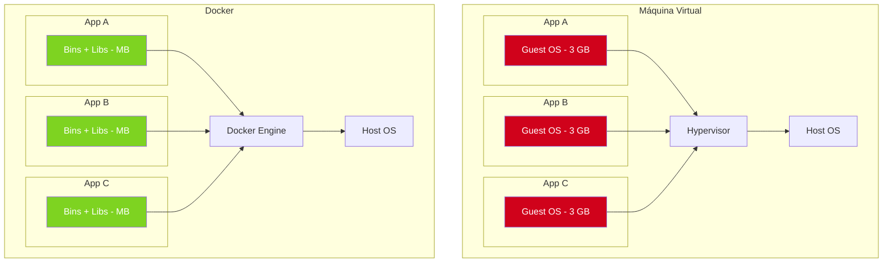

# Capítulo 25: Deploy con Docker — empaquetando y desplegando tu API

> _"En mi máquina funciona"_ — frase célebre del desarrollador junior pre-Docker.

Imagina que tu app funciona perfecto en tu laptop. La pasás a un servidor y... **no funciona**. La versión de Python es distinta, falta una librería, el `PATH` está roto. ¿Suena familiar?

**Docker** resuelve eso: empaqueta tu app con TODO lo que necesita en una "caja" portátil que se ejecuta igual en cualquier máquina. Es como tener un USB mágico que lleva tu entorno completo.

---

## 25.1 Conceptos básicos de Docker

> 🎓 Si ya conocés Docker podés saltar al [25.3](#253-el-problema).

### ¿Qué es un contenedor?

Es un **paquete aislado** que incluye tu app + sus dependencias + el sistema base mínimo. Corre sobre el kernel de la máquina host, pero con su propio sistema de archivos, procesos y red.

| Concepto | Analogía |
|---|---|
| **Imagen** | La "foto" de tu contenedor (cómo es). |
| **Contenedor** | La instancia corriendo de esa imagen. |
| **Dockerfile** | La receta para construir una imagen. |
| **Volumen** | Un disco duro persistente. |
| **Red (network)** | Una red virtual donde los contenedores se ven. |
| **Registry** | Un "GitHub de imágenes" (Docker Hub, GHCR, etc.). |

### ¿En qué se diferencia de una VM?



> 🎓 **Diferencia clave**: las VM virtualizan el **hardware**, Docker virtualiza el **sistema operativo**. Las imágenes de Docker son **100x más livianas**.

---

## 25.2 Instalación de Docker

### Linux (Debian/Ubuntu)

```bash
# Instalación oficial
curl -fsSL https://get.docker.com | sh

# Agregar tu usuario al grupo docker (evita usar sudo)
sudo usermod -aG docker $USER
# Cierra sesión y volvé a entrar

# Verificar
docker --version
docker compose version
```

### macOS / Windows

Descargá [Docker Desktop](https://www.docker.com/products/docker-desktop/).

---

## 25.3 El problema que Docker resuelve

Imaginá el flujo sin Docker:

```
Tu laptop              Servidor de producción
─────────              ─────────────────────
Python 3.12            Python 3.10  ❌
SQLAlchemy 2.0.27      SQLAlchemy 1.4  ❌
psycopg2-binary 2.9    psycopg2 2.8    ❌
SO: macOS              SO: Ubuntu 22   ❌
```

Con Docker, ambos corren el **mismo contenedor**:

```
Tu laptop              Servidor de producción
─────────              ─────────────────────
Docker Engine          Docker Engine
  ↓                      ↓
[Contenedor con Python 3.12 + SQLAlchemy 2.0 + Ubuntu]
   ↓                      ↓
Mismo binario, mismo comportamiento ✅
```

---

## 25.4 Anatomía de un `Dockerfile`

Un `Dockerfile` es la **receta** para construir una imagen. Cada línea es una instrucción.

```dockerfile
# Imagen base
FROM python:3.12-slim

# Variables de entorno
ENV PYTHONDONTWRITEBYTECODE=1 \
    PYTHONUNBUFFERED=1

# Directorio de trabajo dentro del contenedor
WORKDIR /app

# Copiar dependencias
COPY requirements.txt .
RUN pip install --no-cache-dir -r requirements.txt

# Copiar el código
COPY app/ ./app/

# Comando al iniciar
CMD ["uvicorn", "app.main:app", "--host", "0.0.0.0", "--port", "8000"]
```

### Cada instrucción es una "capa"

Docker cachea cada capa. Si no cambia, la reusa. Por eso es importante copiar `requirements.txt` antes que el código:

```dockerfile
# ✅ Correcto: dependencias primero (capa cacheable)
COPY requirements.txt .
RUN pip install -r requirements.txt
COPY app/ ./app/

# ❌ Mal: si cambia el código, se reinstalan las deps
COPY . .
RUN pip install -r requirements.txt
```

---

## 25.5 El `Dockerfile` del manual (multi-stage)

Un **multi-stage build** produce una imagen final más pequeña y segura:

```dockerfile
# syntax=docker/dockerfile:1.6

# ─── Stage 1: builder ───────────────────────────────────────
FROM python:3.12-slim AS builder

ENV PYTHONDONTWRITEBYTECODE=1 \
    PYTHONUNBUFFERED=1 \
    PIP_NO_CACHE_DIR=1

WORKDIR /app

# Solo deps de compilación
RUN apt-get update && apt-get install -y --no-install-recommends \
        build-essential libpq-dev gcc \
    && rm -rf /var/lib/apt/lists/*

COPY requirements.txt .
RUN pip install --prefix=/install --no-cache-dir -r requirements.txt


# ─── Stage 2: runtime ───────────────────────────────────────
FROM python:3.12-slim AS runtime

ENV PYTHONDONTWRITEBYTECODE=1 \
    PYTHONUNBUFFERED=1 \
    PATH="/install/bin:$PATH" \
    PYTHONPATH="/install/lib/python3.12/site-packages"

WORKDIR /app

# Solo lo necesario para RUNTIME (no compiladores)
RUN apt-get update && apt-get install -y --no-install-recommends \
        libpq5 curl \
    && rm -rf /var/lib/apt/lists/*

# Copiar deps ya instaladas
COPY --from=builder /install /install

# Usuario no-root (seguridad)
RUN groupadd -r appuser && useradd -r -g appuser --uid 1000 appuser

# Copiar código
COPY app/ ./app/
COPY scripts/ ./scripts/

RUN chown -R appuser:appuser /app
USER appuser

EXPOSE 8000

# Healthcheck
HEALTHCHECK --interval=30s --timeout=5s --start-period=15s --retries=3 \
    CMD curl -fsS http://localhost:8000/health || exit 1

CMD ["uvicorn", "app.main:app", "--host", "0.0.0.0", "--port", "8000"]
```

### ¿Por qué multi-stage?

| Imagen única | Multi-stage |
|---|---|
| Compiladores + dependencias finales | Solo deps finales |
| ~800 MB | ~150 MB |
| Mayor superficie de ataque | Más seguro |

> 🎓 **Analogía**: es como cocinar. En una cocina (stage 1) tenés ollas, sartenes, mesada sucia. Cuando servís el plato (stage 2), solo llevás el plato limpio a la mesa.

### Variables de entorno importantes

```dockerfile
ENV PYTHONDONTWRITEBYTECODE=1   # no crear .pyc
ENV PYTHONUNBUFFERED=1          # logs aparecen sin buffer
ENV PIP_NO_CACHE_DIR=1          # no cachear pip
```

### Usuario no-root (seguridad)

```dockerfile
RUN groupadd -r appuser && useradd -r -g appuser appuser
USER appuser
```

> ⚠️ **Por qué es importante**: si un atacante entra al contenedor, no debería tener permisos de root. Es una capa más de defensa.

### Healthcheck

```dockerfile
HEALTHCHECK --interval=30s --timeout=5s --start-period=15s --retries=3 \
    CMD curl -fsS http://localhost:8000/health || exit 1
```

Docker pregunta cada 30 segundos: "¿la app responde?". Si falla 3 veces seguidas, **Docker reinicia el contenedor**.

---

## 25.6 `.dockerignore`: lo que NO se copia

Archivo clave para acelerar builds y evitar filtrar secretos:

```gitignore
# Python
__pycache__/
*.py[cod]
*.so
.venv/

# Tests
.pytest_cache/

# Variables de entorno (NUNCA)
.env

# Base de datos local
*.db
*.sqlite

# Git
.git/
.gitignore

# Docker mismo
Dockerfile
docker-compose*.yml
```

---

## 25.7 `docker-compose.yml`: orquestar varios servicios

`docker-compose` te permite definir **múltiples contenedores** en un solo archivo YAML y manejarlos como uno.

```yaml
services:
  db:
    image: postgres:16-alpine
    environment:
      POSTGRES_USER: postgres
      POSTGRES_PASSWORD: postgres
      POSTGRES_DB: tienda
    volumes:
      - pgdata:/var/lib/postgresql/data
    ports:
      - "5432:5432"
    healthcheck:
      test: ["CMD-SHELL", "pg_isready -U postgres -d tienda"]
      interval: 5s
      timeout: 5s
      retries: 10

  api:
    build: .
    depends_on:
      db:
        condition: service_healthy
    environment:
      DATABASE_URL: postgresql+psycopg2://postgres:postgres@db:5432/tienda
    ports:
      - "8000:8000"
    volumes:
      - ./app:/app/app:ro    # hot reload en dev
    command: >
      sh -c "alembic upgrade head &&
             uvicorn app.main:app --host 0.0.0.0 --port 8000 --reload"

volumes:
  pgdata:
```

### Anatomía sección por sección

| Clave | Para qué sirve |
|---|---|
| `services` | Los contenedores a levantar. |
| `image` / `build` | Imagen existente o construir desde Dockerfile. |
| `ports` | Mapeo de puertos `host:contenedor`. |
| `environment` | Variables de entorno. |
| `volumes` | Mapeo de carpetas/archivos. |
| `depends_on` | Orden de arranque + healthcheck opcional. |
| `networks` | Red virtual compartida. |
| `healthcheck` | Test de salud para el servicio. |
| `restart` | Política de reinicio (`unless-stopped`, `always`). |

### El truco `depends_on: condition: service_healthy`

```yaml
depends_on:
  db:
    condition: service_healthy   # 👈 Espera a que la DB pase el healthcheck
```

> 🎓 **Sin esto**: la API arranca antes que la DB esté lista → `Connection refused`.  
> **Con esto**: la API espera hasta que la DB responda.

### Volúmenes

```yaml
volumes:
  - pgdata:/var/lib/postgresql/data   # volumen nombrado (persiste entre levantadas)
  - ./app:/app/app:ro                 # bind mount (carpeta del host)
```

| Tipo | Persiste | Para qué |
|---|---|---|
| **Volumen nombrado** (`pgdata`) | ✅ sí | Bases de datos, datos importantes. |
| **Bind mount** (`./app:/app/app`) | 🟠 depende del host | Código en dev (hot reload). |
| **Anonymous volume** (`/data`) | ❌ se borra al `down` | Caché temporal. |

### Redes

```yaml
networks:
  tienda_net:
    driver: bridge
```

Por defecto, los servicios en el mismo `docker-compose` están en la misma red y se ven por **nombre de servicio**. Por eso en la URL usamos `db:5432` (no `localhost`).

---

## 25.8 El `entrypoint.sh`: orquestar al iniciar

A veces necesitás **correr cosas antes** de arrancar la app (como migraciones). Para eso sirve el `entrypoint`:

```bash
#!/bin/sh
set -e

echo "🐳 Iniciando contenedor..."
echo "⏳ Esperando a la base de datos..."

for i in $(seq 1 30); do
    if python -c "from app.database import engine; engine.connect().close()" 2>/dev/null; then
        echo "✅ DB lista"
        break
    fi
    sleep 1
done

echo "📦 Aplicando migraciones..."
alembic upgrade head

echo "🚀 Arrancando app..."
exec "$@"
```

Y en el Dockerfile:

```dockerfile
COPY scripts/entrypoint.sh /entrypoint.sh
RUN chmod +x /entrypoint.sh
ENTRYPOINT ["/entrypoint.sh"]
CMD ["uvicorn", "app.main:app", "--host", "0.0.0.0", "--port", "8000"]
```

> 🎓 **`exec "$@"`** es la clave: reemplaza el proceso actual con el comando (`CMD`). Sin esto, el `entrypoint` queda corriendo en background.

---

## 25.9 Comandos esenciales

```bash
# Construir imágenes
docker compose build

# Levantar (foreground)
docker compose up

# Levantar en background
docker compose up -d

# Ver servicios corriendo
docker compose ps

# Logs
docker compose logs -f
docker compose logs -f api      # solo la API

# Ejecutar comando en contenedor corriendo
docker compose exec api ls
docker compose exec api alembic revision --autogenerate -m "nueva col"

# Abrir shell
docker compose exec api bash

# Detener
docker compose stop

# Detener Y borrar contenedores
docker compose down

# ⚠️ Detener Y borrar TODO (incluidos volúmenes con datos)
docker compose down -v
```

---

## 25.10 Flujo completo de deploy con Docker

### 1. Desarrollo local con Docker

```bash
cd mi_proyecto/
docker compose up --build
# Espera a que termine el build y arranca los servicios
# Mirá los logs: alembic upgrade head, después uvicorn

# En otra terminal
docker compose ps
curl http://localhost:8000/docs
```

### 2. Modificar el código

Como en `dev` montás `./app` como volumen, los cambios se ven al instante (gracias al `--reload`).

### 3. Crear una nueva migración

```bash
# Modificás un modelo en app/models/producto.py
docker compose exec api alembic revision --autogenerate -m "agregar stock"
docker compose exec api alembic upgrade head
```

### 4. Build para producción

```bash
docker build -t mi-usuario/tienda-api:1.0.0 .
```

### 5. Subir a un registry

```bash
# Login (Docker Hub)
docker login

# Tag
docker tag mi-usuario/tienda-api:1.0.0 mi-usuario/tienda-api:latest

# Push
docker push mi-usuario/tienda-api:1.0.0
docker push mi-usuario/tienda-api:latest
```

### 6. Deploy en el servidor

```bash
# En el servidor (Linux)
git clone https://github.com/usuario/tienda.git
cd tienda

# Crear .env con secrets
cat > .env.prod <<EOF
POSTGRES_PASSWORD=contraseña-segura-de-32-chars
API_IMAGE=mi-usuario/tienda-api:1.0.0
EOF

# Levantar
docker compose -f docker-compose.prod.yml --env-file .env.prod up -d

# Ver logs
docker compose -f docker-compose.prod.yml logs -f
```

---

## 25.11 Patrones avanzados

### Healthcheck en FastAPI

Para que el healthcheck de Docker funcione, necesitamos un endpoint:

```python
# app/main.py
@app.get("/health", tags=["meta"])
def health():
    return {"status": "ok"}
```

> 🎓 **Mejor healthcheck**: que valide también la DB:

```python
from sqlalchemy import text

@app.get("/health", tags=["meta"])
def health(session: SessionDep):
    try:
        session.execute(text("SELECT 1"))
        return {"status": "ok"}
    except Exception as e:
        raise HTTPException(503, detail=f"DB no disponible: {e}")
```

### Logs estructurados

Para producción, no `print`. Usá `logging` a stdout:

```python
import logging
import sys

logging.basicConfig(
    level=logging.INFO,
    format="%(asctime)s [%(levelname)s] %(name)s: %(message)s",
    stream=sys.stdout,  # 👈 Docker captura stdout
)
```

### Limitar recursos

```yaml
deploy:
  resources:
    limits:
      cpus: "0.5"
      memory: 512M
    reservations:
      cpus: "0.1"
      memory: 128M
```

> ⚠️ Esto funciona con Docker Swarm. Para Compose v2 en Kubernetes, usá otra sintaxis.

### Nginx como reverse proxy

Para producción, ponés Nginx delante de FastAPI:

```nginx
server {
    listen 80;
    server_name api.example.com;

    location / {
        proxy_pass http://api:8000;
        proxy_set_header Host $host;
        proxy_set_header X-Real-IP $remote_addr;
    }
}
```

> 🎓 **Para qué Nginx**: SSL/TLS, gzip, rate limit, static files, balanceo de carga.

### Secrets de Docker (más seguro que `.env`)

```yaml
services:
  api:
    environment:
      DATABASE_URL: postgresql://user:$(cat /run/secrets/db_password)@db/db
    secrets:
      - db_password

secrets:
  db_password:
    file: ./secrets/db_password.txt
```

---

## 25.12 Troubleshooting

### "Connection refused" al conectar a la DB

**Causa**: la API arrancó antes que la DB.

**Solución 1**: usá `depends_on: condition: service_healthy`.

**Solución 2**: agregá retry en el código:

```python
import time
from sqlalchemy import create_engine
from sqlalchemy.exc import OperationalError

for attempt in range(30):
    try:
        engine = create_engine(settings.database_url)
        with engine.connect() as conn:
            conn.execute(text("SELECT 1"))
        break
    except OperationalError:
        print(f"DB no lista, intento {attempt + 1}/30")
        time.sleep(1)
else:
    raise RuntimeError("No se pudo conectar a la DB")
```

### "Permission denied" en volúmenes

**Causa**: el usuario dentro del contenedor no puede escribir en el volumen.

**Solución**: ajustá los permisos:

```bash
chown -R 1000:1000 ./pgdata
```

O en el Dockerfile:

```dockerfile
RUN chown -R appuser:appuser /app/data
```

### Build muy lento

**Causa**: cambiando el `requirements.txt` invalida el cache.

**Solución**: copiá requirements antes que el código:

```dockerfile
COPY requirements.txt .
RUN pip install -r requirements.txt
COPY . .
```

### Imagen muy grande

**Causa**: estás incluyendo cosas innecesarias.

**Solución**: multi-stage + `.dockerignore` + `slim` en vez de `full`.

### Cambios no se reflejan

**Causa**: olvidaste montar el volumen o no tenés `--reload`.

**Solución**: en `dev`, esto:

```yaml
volumes:
  - ./app:/app/app:ro
command: uvicorn app.main:app --reload --host 0.0.0.0
```

---

## 25.13 Docker Compose vs Kubernetes

| Aspecto | Docker Compose | Kubernetes (K8s) |
|---|---|---|
| **Complejidad** | 🟢 baja | 🔴 alta |
| **Ideal para** | 1-10 servicios | 100+ servicios |
| **Auto-scaling** | ❌ | ✅ |
| **Auto-healing** | 🟠 básico | ✅ avanzado |
| **Load balancing** | ❌ | ✅ |
| **Costo operativo** | 🟢 bajo | 🔴 alto |

> 🎓 **Consejo del profesor**: empezá con `docker-compose`. Cuando te quede corto, migrá a **K8s**, **Nomad**, **ECS** o **Fly.io**.

---

## 25.14 Alternativas modernas a Docker

| Plataforma | Para qué |
|---|---|
| **Fly.io** | Deploy directo desde Git, con DBs incluidas. |
| **Railway** | Similar, muy fácil. |
| **Render** | Docker o buildpacks. |
| **AWS ECS/Fargate** | Docker en AWS sin Kubernetes. |
| **Modal / Replicate** | Para apps con ML. |
| **Google Cloud Run** | Serverless para contenedores. |

Para una app chica como la del manual, **Fly.io** o **Railway** son opciones rápidas y baratas.

---

## 25.15 Checklist de deploy

- [ ] ✅ `Dockerfile` con multi-stage.
- [ ] ✅ Imagen corre como usuario no-root.
- [ ] ✅ Healthcheck configurado.
- [ ] ✅ `.dockerignore` evita filtrar secretos.
- [ ] ✅ Variables de entorno leídas de `.env` o env vars.
- [ ] ✅ Migraciones corren antes de iniciar la app.
- [ ] ✅ Volúmenes para datos persistentes (DB).
- [ ] ✅ Compose con `depends_on: service_healthy`.
- [ ] ✅ Logs a stdout.
- [ ] ✅ Límites de recursos.
- [ ] ✅ TLS / HTTPS en producción (Nginx o cloudflare).
- [ ] ✅ Backups de la DB.
- [ ] ✅ Monitoreo (Prometheus, Grafana, Sentry).
- [ ] ✅ CI/CD para builds automáticos.

---

## 🛠️ Ejercicios prácticos

### 🟢 Ejercicio 25.1: Tu primer Dockerfile

Escribí un Dockerfile básico para una app Python con un script `app.py`. Construilo y verifica que funciona.

**Solución**: [soluciones/25-docker.md](../soluciones/25-docker.md#ejercicio-251)

---

### 🟡 Ejercicio 25.2: Compose simple

Modelá un `docker-compose.yml` con:

- Un servicio `app` (construido desde Dockerfile, puerto 8000).
- Un servicio `db` (Postgres, puerto 5432).
- Volumen para la DB.
- Healthcheck en la DB.

**Solución**: [soluciones/25-docker.md](../soluciones/25-docker.md#ejercicio-252)

---

### 🟡 Ejercicio 25.3: Multi-stage

Reescribí el Dockerfile del ejercicio 25.1 con multi-stage. Compará el tamaño de la imagen.

**Solución**: [soluciones/25-docker.md](../soluciones/25-docker.md#ejercicio-253)

---

### 🟡 Ejercicio 25.4: Healthcheck

Implementá un endpoint `/health` en tu FastAPI. Configurá el `HEALTHCHECK` en el Dockerfile. Verificá con `docker inspect`.

**Solución**: [soluciones/25-docker.md](../soluciones/25-docker.md#ejercicio-254)

---

### 🟡 Ejercicio 25.5: Entrypoint con migración

Escribí un `entrypoint.sh` que:

1. Espere a que la DB esté lista.
2. Aplique migraciones con Alembic.
3. Levante Uvicorn.

**Solución**: [soluciones/25-docker.md](../soluciones/25-docker.md#ejercicio-255)

---

### 🔴 Ejercicio 25.6: CI/CD con GitHub Actions

Escribí un workflow `.github/workflows/deploy.yml` que:

1. Corra tests.
2. Construya la imagen con tag.
3. Push al GitHub Container Registry.

**Solución**: [soluciones/25-docker.md](../soluciones/25-docker.md#ejercicio-256)

---

## 🎓 Lo que aprendiste

- **Docker** empaqueta tu app con sus dependencias en una imagen portátil.
- **Multi-stage builds** producen imágenes finales pequeñas y seguras.
- **docker-compose** orquesta varios contenedores (API + DB + cache).
- **Healthchecks** permiten que Docker sepa si tu app está sana.
- El **entrypoint** corre cosas antes de la app (como migraciones).
- Para producción: separar `.env` de secretos, usar volumes para datos, deshabilitar hot reload.

## 📖 Cierre del manual

Llegaste al **último capítulo del manual completo**. Recorriste:

- ✅ **24 capítulos anteriores** (de fundamentos a avanzado) + **este** = 25.
- ✅ Proyecto FastAPI + SQLAlchemy 2.0 ejecutable con tests.
- ✅ Dockerfile multi-stage, docker-compose dev y prod.
- ✅ Patrones de deploy profesionales.

### Tu próximo paso

Probá levantar el proyecto con Docker:

```bash
cd proyecto/fastapi_sqlalchemy
docker compose up --build
# → http://localhost:8000/docs
```

Después, animate a hacer deploy en **Fly.io** o **Railway**. Es 5 minutos y vas a ver tu app en internet. 🚀

¡Mucho éxito! 🐍🐳🚀