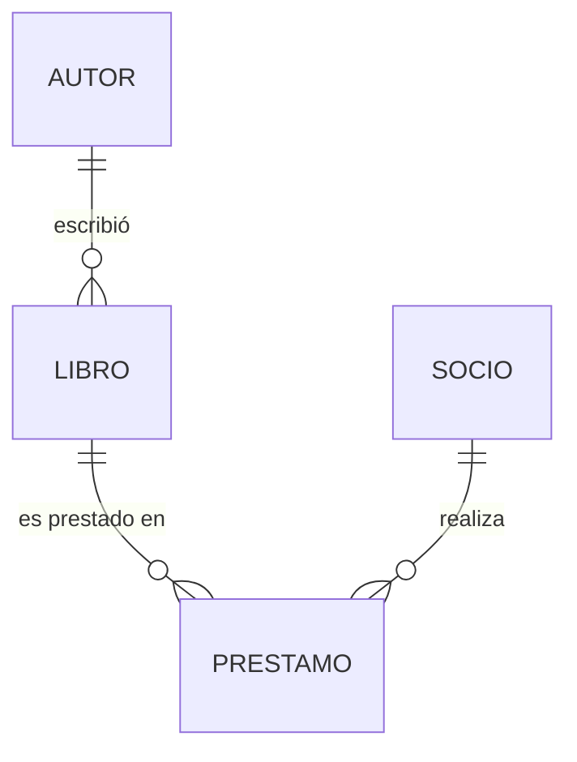

# Soluciones — Capítulo 9: El primer modelo completo

[Volver al capítulo 9](../capitulos/09-primer-modelo.md)

---

## Ejercicio 9.1

**Extender el modelo**

```python
from sqlalchemy import Integer, JSON
from typing import Optional


class Producto(Base):
    __tablename__ = "productos"

    id: Mapped[int] = mapped_column(primary_key=True)
    nombre: Mapped[str] = mapped_column(String(100), index=True)  # 👈 índice
    sku: Mapped[str] = mapped_column(String(20), unique=True)
    precio: Mapped[float] = mapped_column(Numeric(10, 2))
    descripcion: Mapped[Optional[str]] = mapped_column(default=None)

    # 👇 Nuevos
    stock: Mapped[int] = mapped_column(Integer, default=0, nullable=False)
    tags: Mapped[Optional[list]] = mapped_column(JSON, default=None)

    categoria_id: Mapped[Optional[int]] = mapped_column(
        ForeignKey("categorias.id"), default=None
    )
    categoria: Mapped["Categoria | None"] = relationship(back_populates="productos")
```

[Volver al ejercicio ↑](../capitulos/09-primer-modelo.md#%C2%B0-ejercicio-91)

---

## Ejercicio 9.2

**Generar el SQL**

```python
from sqlalchemy import create_engine

engine = create_engine("sqlite:///:memory:", echo=True)
Base.metadata.create_all(engine)
```

Con `echo=True`, vas a ver el SQL emitido. La salida esperada (resumida):

```sql
CREATE TABLE categorias (
    id INTEGER NOT NULL PRIMARY KEY,
    nombre VARCHAR(50) NOT NULL UNIQUE,
    descripcion VARCHAR,
    creado_en DATETIME DEFAULT CURRENT_TIMESTAMP,
    actualizado_en DATETIME DEFAULT CURRENT_TIMESTAMP
);
CREATE UNIQUE INDEX ix_categorias_nombre ON categorias (nombre);

CREATE TABLE productos (
    id INTEGER NOT NULL PRIMARY KEY,
    nombre VARCHAR(100) NOT NULL,
    sku VARCHAR(20) NOT NULL UNIQUE,
    precio NUMERIC(10, 2) NOT NULL,
    descripcion VARCHAR,
    stock INTEGER NOT NULL DEFAULT 0,
    tags JSON,
    categoria_id INTEGER,
    creado_en DATETIME DEFAULT CURRENT_TIMESTAMP,
    actualizado_en DATETIME DEFAULT CURRENT_TIMESTAMP,
    FOREIGN KEY(categoria_id) REFERENCES categorias (id)
);
CREATE INDEX ix_productos_nombre ON productos (nombre);
CREATE INDEX ix_producto_precio ON productos (precio);

CREATE TABLE inventarios (
    id INTEGER NOT NULL PRIMARY KEY,
    producto_id INTEGER NOT NULL UNIQUE,
    cantidad INTEGER NOT NULL DEFAULT 0,
    stock_minimo INTEGER NOT NULL DEFAULT 5,
    ubicacion VARCHAR(50),
    actualizado_en DATETIME DEFAULT CURRENT_TIMESTAMP,
    FOREIGN KEY(producto_id) REFERENCES productos (id)
);
```

[Volver al ejercicio ↑](../capitulos/09-primer-modelo.md#%C2%B0-ejercicio-92)

---

## Ejercicio 9.3

**Tabla de unión (N—M)**

```python
proveedor_producto = Table(
    "proveedor_producto",
    Base.metadata,
    Column("proveedor_id", Integer, ForeignKey("proveedores.id"), primary_key=True),
    Column("producto_id", Integer, ForeignKey("productos.id"), primary_key=True),
)


class Proveedor(Base):
    __tablename__ = "proveedores"

    id: Mapped[int] = mapped_column(primary_key=True)
    nombre: Mapped[str] = mapped_column(String(80))
    email: Mapped[str] = mapped_column(String(120))
    telefono: Mapped[Optional[str]] = mapped_column(default=None)

    productos: Mapped[List["Producto"]] = relationship(
        back_populates="proveedores",
        secondary=proveedor_producto,
    )


class Producto(Base):
    # ... campos existentes ...
    proveedores: Mapped[List["Proveedor"]] = relationship(
        back_populates="productos",
        secondary=proveedor_producto,
    )
```

[Volver al ejercicio ↑](../capitulos/09-primer-modelo.md#%C2%B1-ejercicio-93)

---

## Ejercicio 9.4

**Self-reference en Categoria**

```python
class Categoria(Base):
    __tablename__ = "categorias"

    id: Mapped[int] = mapped_column(primary_key=True)
    nombre: Mapped[str] = mapped_column(String(50), unique=True)
    descripcion: Mapped[Optional[str]] = mapped_column(default=None)

    padre_id: Mapped[Optional[int]] = mapped_column(
        ForeignKey("categorias.id"), default=None
    )

    padre: Mapped[Optional["Categoria"]] = relationship(
        back_populates="hijas",
        remote_side="Categoria.id",
    )

    hijas: Mapped[List["Categoria"]] = relationship(
        back_populates="padre",
        cascade="all, delete-orphan",
    )
```

[Volver al ejercicio ↑](../capitulos/09-primer-modelo.md#%C2%B1-ejercicio-94)

---

## Ejercicio 9.5

**Diseño completo: Biblioteca**

```python
from datetime import date
from typing import List, Optional


class Autor(Base, TimestampMixin):
    __tablename__ = "autores"
    id: Mapped[int] = mapped_column(primary_key=True)
    nombre: Mapped[str] = mapped_column(String(120), index=True)
    biografia: Mapped[Optional[str]] = mapped_column(Text, default=None)

    libros: Mapped[List["Libro"]] = relationship(back_populates="autor")


class Libro(Base, TimestampMixin):
    __tablename__ = "libros"
    id: Mapped[int] = mapped_column(primary_key=True)
    titulo: Mapped[str] = mapped_column(String(200), index=True)
    isbn: Mapped[str] = mapped_column(String(13), unique=True)
    anio: Mapped[int] = mapped_column(Integer, index=True)

    autor_id: Mapped[int] = mapped_column(ForeignKey("autores.id"))
    autor: Mapped["Autor"] = relationship(back_populates="libros")

    prestamos: Mapped[List["Prestamo"]] = relationship(
        back_populates="libro", cascade="all, delete-orphan"
    )


class Socio(Base, TimestampMixin):
    __tablename__ = "socios"
    id: Mapped[int] = mapped_column(primary_key=True)
    nombre: Mapped[str] = mapped_column(String(120))
    email: Mapped[str] = mapped_column(String(120), unique=True)
    fecha_registro: Mapped[date] = mapped_column(Date, default=date.today)

    prestamos: Mapped[List["Prestamo"]] = relationship(
        back_populates="socio", cascade="all, delete-orphan"
    )


class Prestamo(Base, TimestampMixin):
    __tablename__ = "prestamos"
    id: Mapped[int] = mapped_column(primary_key=True)
    fecha_prestamo: Mapped[date] = mapped_column(Date, default=date.today)
    fecha_devolucion: Mapped[Optional[date]] = mapped_column(default=None)

    libro_id: Mapped[int] = mapped_column(ForeignKey("libros.id"))
    libro: Mapped["Libro"] = relationship(back_populates="prestamos")

    socio_id: Mapped[int] = mapped_column(ForeignKey("socios.id"))
    socio: Mapped["Socio"] = relationship(back_populates="prestamos")

    __table_args__ = (
        Index("ix_prestamo_libro_socio", "libro_id", "socio_id"),
    )
```

**Diagrama**:



[Volver al ejercicio ↑](../capitulos/09-primer-modelo.md#%F0%9F%94%B4-ejercicio-95)