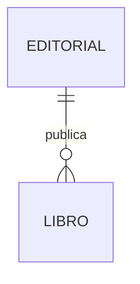

# Soluciones — Capítulo 13: Relaciones entre tablas

[Volver al capítulo 13](../capitulos/13-relaciones.md)

---

## Ejercicio 13.1

**Relación 1—N**

```python
from typing import List
from sqlalchemy import String, ForeignKey
from sqlalchemy.orm import DeclarativeBase, Mapped, mapped_column, relationship


class Base(DeclarativeBase):
    pass


class Editorial(Base):
    __tablename__ = "editoriales"

    id: Mapped[int] = mapped_column(primary_key=True)
    nombre: Mapped[str] = mapped_column(String(120), unique=True)

    libros: Mapped[List["Libro"]] = relationship(
        back_populates="editorial",
        cascade="all, delete-orphan",
    )


class Libro(Base):
    __tablename__ = "libros"

    id: Mapped[int] = mapped_column(primary_key=True)
    titulo: Mapped[str] = mapped_column(String(200))

    editorial_id: Mapped[int] = mapped_column(ForeignKey("editoriales.id"))
    editorial: Mapped["Editorial"] = relationship(back_populates="libros")
```



[Volver al ejercicio ↑](../capitulos/13-relaciones.md#%C2%B0-ejercicio-131)

---

## Ejercicio 13.2

**Relación 1—1**

```python
class Persona(Base):
    __tablename__ = "personas"
    id: Mapped[int] = mapped_column(primary_key=True)
    nombre: Mapped[str]

    pasaporte: Mapped["Pasaporte | None"] = relationship(
        back_populates="persona", uselist=False, cascade="all, delete-orphan"
    )


class Pasaporte(Base):
    __tablename__ = "pasaportes"
    id: Mapped[int] = mapped_column(primary_key=True)
    numero: Mapped[str] = mapped_column(String(20), unique=True)

    persona_id: Mapped[int] = mapped_column(
        ForeignKey("personas.id"), unique=True   # 👈 clave única
    )
    persona: Mapped["Persona"] = relationship(
        back_populates="pasaporte", uselist=False
    )
```

[Volver al ejercicio ↑](../capitulos/13-relaciones.md#%C2%B0-ejercicio-132)

---

## Ejercicio 13.3

**N—M simple**

```python
peliculas_actores = Table(
    "peliculas_actores",
    Base.metadata,
    Column("pelicula_id", Integer, ForeignKey("peliculas.id"), primary_key=True),
    Column("actor_id", Integer, ForeignKey("actores.id"), primary_key=True),
)


class Pelicula(Base):
    __tablename__ = "peliculas"
    id: Mapped[int] = mapped_column(primary_key=True)
    titulo: Mapped[str]

    actores: Mapped[List["Actor"]] = relationship(
        back_populates="peliculas",
        secondary=peliculas_actores,
    )


class Actor(Base):
    __tablename__ = "actores"
    id: Mapped[int] = mapped_column(primary_key=True)
    nombre: Mapped[str]

    peliculas: Mapped[List["Pelicula"]] = relationship(
        back_populates="actores",
        secondary=peliculas_actores,
    )
```

[Volver al ejercicio ↑](../capitulos/13-relaciones.md#%C2%B1-ejercicio-133)

---

## Ejercicio 13.4

**N—M con metadata**

```python
class Actuacion(Base):
    __tablename__ = "actuaciones"
    pelicula_id: Mapped[int] = mapped_column(
        ForeignKey("peliculas.id"), primary_key=True
    )
    actor_id: Mapped[int] = mapped_column(
        ForeignKey("actores.id"), primary_key=True
    )
    rol: Mapped[str]

    pelicula: Mapped["Pelicula"] = relationship(back_populates="actuaciones")
    actor: Mapped["Actor"] = relationship(back_populates="actuaciones")


class Pelicula(Base):
    id: Mapped[int] = mapped_column(primary_key=True)
    titulo: Mapped[str]

    actuaciones: Mapped[List["Actuacion"]] = relationship(
        back_populates="pelicula", cascade="all, delete-orphan"
    )
    actores: Mapped[List["Actor"]] = relationship(
        secondary="actuaciones", viewonly=True
    )


class Actor(Base):
    id: Mapped[int] = mapped_column(primary_key=True)
    nombre: Mapped[str]

    actuaciones: Mapped[List["Actuacion"]] = relationship(
        back_populates="actor", cascade="all, delete-orphan"
    )
    peliculas: Mapped[List["Pelicula"]] = relationship(
        secondary="actuaciones", viewonly=True
    )
```

Uso:

```python
p = Pelicula(titulo="Inception")
a = Actor(nombre="DiCaprio")
actuacion = Actuacion(rol="Cobb", pelicula=p, actor=a)
```

[Volver al ejercicio ↑](../capitulos/13-relaciones.md#%C2%B1-ejercicio-134)

---

## Ejercicio 13.5

**Self-reference**

```python
from sqlalchemy.orm import aliased
from sqlalchemy import select


class Empleado(Base):
    __tablename__ = "empleados"
    id: Mapped[int] = mapped_column(primary_key=True)
    nombre: Mapped[str]
    jefe_id: Mapped[Optional[int]] = mapped_column(
        ForeignKey("empleados.id"), default=None
    )

    jefe: Mapped[Optional["Empleado"]] = relationship(
        "Empleado", remote_side="Empleado.id", backref="subordinados"
    )


EmpleadoJefe = aliased(Empleado)

stmt = (
    select(Empleado, EmpleadoJefe)
    .join(EmpleadoJefe, Empleado.jefe_id == EmpleadoJefe.id, isouter=True)
)

for emp, jefe in session.execute(stmt):
    nombre_jefe = jefe.nombre if jefe else "Sin jefe"
    print(f"{emp.nombre} → {nombre_jefe}")
```

[Volver al ejercicio ↑](../capitulos/13-relaciones.md#%C2%B1-ejercicio-135)

---

## Ejercicio 13.6

**Cascade**

| Caso | Al borrar usuario | Al borrar dirección |
|---|---|---|
| `cascade="all, delete-orphan"` | ✅ También se borran las direcciones | ✅ Se borra la dirección |
| `cascade="save-update"` | ❌ Las direcciones quedan huérfanas (FK inválida) | ✅ Se borra la dirección |
| Sin cascade | ❌ Las direcciones quedan huérfanas | ✅ Se borra la dirección (manual) |

`delete-orphan` significa: si una dirección deja de tener usuario (ej: `direccion.usuario = None`), se borra automáticamente.

[Volver al ejercicio ↑](../capitulos/13-relaciones.md#%C2%B1-ejercicio-136)

---

## Ejercicio 13.7

**Resolvé N+1**

```python
from sqlalchemy.orm import selectinload


stmt = select(Producto).options(selectinload(Producto.categoria))
for producto in session.scalars(stmt):
    print(producto.categoria.nombre)
```

**Antes**: 1 + N queries (problema N+1).
**Después**: 2 queries (la principal + un `SELECT ... WHERE producto_id IN (...)`).

[Volver al ejercicio ↑](../capitulos/13-relaciones.md#%C2%B1-ejercicio-137)

---

## Ejercicio 13.8

**Query con COUNT**

```python
from sqlalchemy import func


stmt = (
    select(
        Usuario.nombre,
        func.count(Direccion.id).label("cantidad_direcciones"),
    )
    .outerjoin(Direccion)
    .group_by(Usuario.id)
)
```

`outerjoin` es LEFT JOIN, así usuarios sin direcciones también aparecen (con count = 0).

[Volver al ejercicio ↑](../capitulos/13-relaciones.md#%F0%9F%94%B4-ejercicio-138)

---

## Ejercicio 13.9

**Soft delete con cascade**

```python
from datetime import datetime
from typing import List, Optional
from sqlalchemy import ForeignKey, event
from sqlalchemy.orm import DeclarativeBase, Mapped, mapped_column, relationship


class Base(DeclarativeBase):
    pass


class Categoria(Base):
    __tablename__ = "categorias"
    id: Mapped[int] = mapped_column(primary_key=True)
    nombre: Mapped[str]
    eliminado_en: Mapped[Optional[datetime]] = mapped_column(default=None)

    productos: Mapped[List["Producto"]] = relationship(
        back_populates="categoria",
    )


class Producto(Base):
    __tablename__ = "productos"
    id: Mapped[int] = mapped_column(primary_key=True)
    nombre: Mapped[str]
    eliminado_en: Mapped[Optional[datetime]] = mapped_column(default=None)

    categoria_id: Mapped[int] = mapped_column(ForeignKey("categorias.id"))
    categoria: Mapped["Categoria"] = relationship(back_populates="productos")


# Evento: al soft-delete de categoría, marcar productos
@event.listens_for(Categoria, "before_update")
def cascade_soft_delete(mapper, connection, target):
    if target.deleted_en is not None:
        # La categoría fue marcada como eliminada → marcar productos
        connection.execute(
            Producto.__table__.update()
            .where(Producto.categoria_id == target.id)
            .values(eliminado_en=target.eliminado_en)
        )
```

[Volver al ejercicio ↑](../capitulos/13-relaciones.md#%F0%9F%94%B4-ejercicio-139)